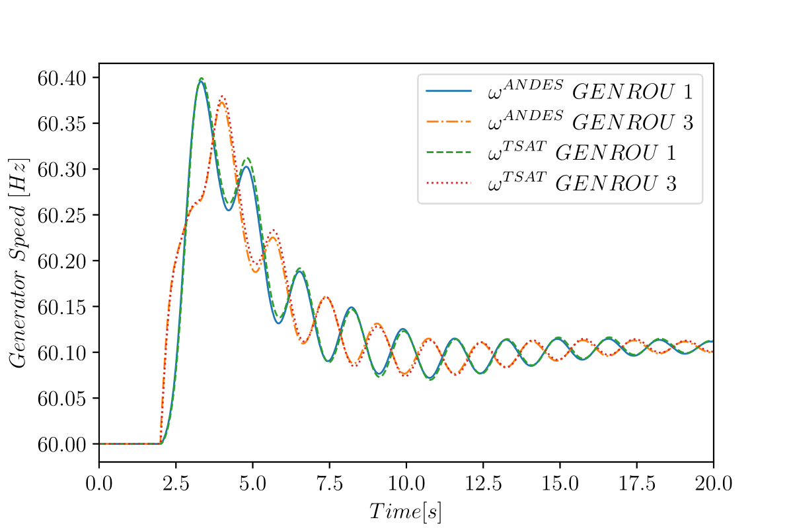
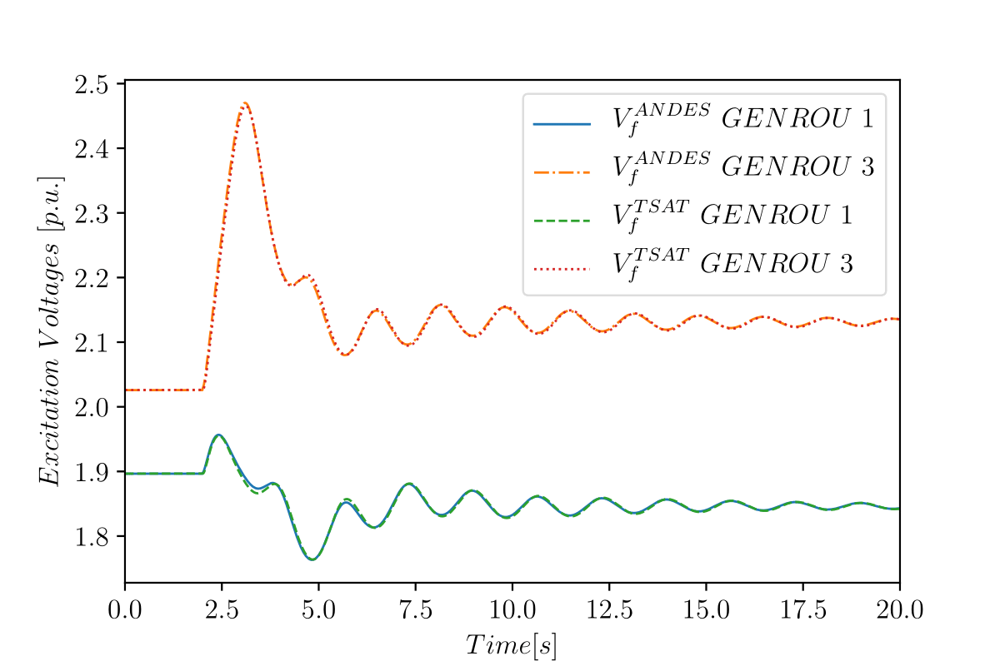
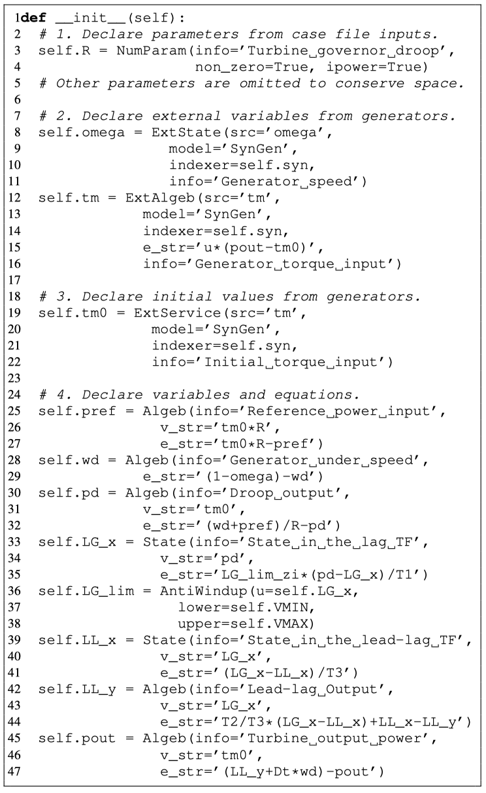
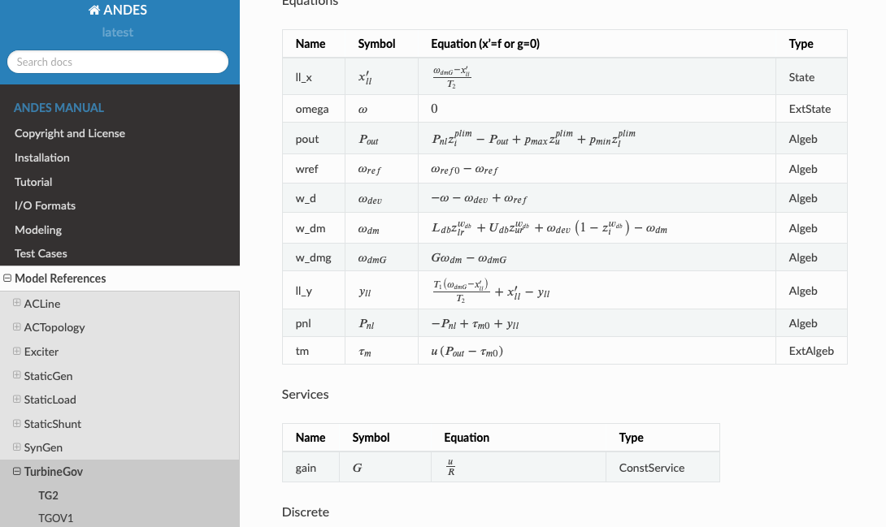

# ANDES

[](https://github.com/cuihantao/andes/actions)
[](https://dev.azure.com/hcui7/hcui7/_build/latest?definitionId=1&branchName=master)
[](https://codecov.io/gh/cuihantao/andes)
[](https://app.codacy.com/app/cuihantao/andes?utm_source=github.com&utm_medium=referral&utm_content=cuihantao/andes&utm_campaign=Badge_Grade_Dashboard)
[](https://pypi.python.org/pypi/andes)

A Python-based tool for symbolic power system modeling and numerical analysis.

# Why ANDES?

ANDES is by far easier to use for modeling power system devices than other 
simulation tools such as 
[PSAT](http://faraday1.ucd.ie/psat.html),
[Dome](http://faraday1.ucd.ie/dome.html) and
[PST](https://www.ecse.rpi.edu/~chowj/),
while maintaining high numerical efficiency.

ANDES produces accurate simulation results.
For the Kundur's two-area system with GENROU, TGOV1 and EXDC2, ANDES produces almost identical 
(<1% discrepancy) results to that from DSATools TSAT™.   

| Generator Speed | Excitation Voltage |
| --------------- | ------------------ |
|  |  |

ANDES provides a descriptive modeling framework in a scripting environment.
Modeling DAE-based devices is as simple as describing the mathematical equations.

| Controller Model and Equation | ANDES Code |
| ----------------------------- | ---------- |
| TGOV1:  <br><br> DAE:   |  |

In ANDES, what you simulate is what you document. 
ANDES automatically generates model documentation, and the docs always stay up to date.
The screenshot below is the generated documentation for the implemented TGOV1 model.



In addition, ANDES features

- Power flow, trapezoidal method-based time domain simulation, and full eigenvalue analysis.
- Support PSS/E raw and dyr inputs among other formats.
- Symbolic DAE modeling and automated code generation for numerical simulation.
- Numerical DAE modeling for cases when symbolic implementations are difficult.
- Modeling library with common transfer functions and discontinuous blocks.
- Automatic sequential and iterative initialization (experimental) for dynamic models.
- Full equation documentation of supported DAE models.

ANDES is currently under active development.
Visit the documentation to learn more about ANDES.
Technical details can be referred to our paper on arXiv.

# Table of Contents
* [Get Started with ANDES](#get-started-with-andes)
* [Run Simulations](#run-simulations)
   * [Step 1: Power Flow](#step-1-power-flow)
   * [Step 2: Dynamic Analysis](#step-2-dynamic-analyses)
   * [Step 3: Plot Results](#step-3-plot-results)
* [Configure ANDES](#configure-andes)
* [Format Converter](#format-converter)
   * [Input Converter](#input-converter)
   * [Output Converter](#output-converter)
* [Model Development](#model-development)
   * [Step 1: Define Parameters](#step-1-define-parameters)
   * [Step 2: Define Externals](#step-2-define-externals)
   * [Step 3: Define Variables](#step-3-define-variables)
   * [Step 4: Define Equations](#step-4-define-equations)
   * [Step 5: Define Initializers](#step-5-define-initializers)
* [API Reference](#api-reference)
* [System Requirements](#system-requirements)
* [Get Involved](#get-involved)
* [Who is Using ANDES?](#who-is-using-andes)

# Get Started with ANDES

ANDES is a Python package and needs to be installed. 
We recommend Miniconda if you don't insist on an existing Python environment.
Downloaded and install the latest **64-bit** Miniconda3 for your platform from <https://conda.io/miniconda.html>.

Step 1: (Optional) Open the *Anaconda Prompt* (shell on Linux and macOS) and create a new environment.

Use the following command in the Anaconda Prompt: 

``` bash
conda create --name andes python=3.7
```

Step 2: Add the `conda-forge` channel and set it to default. Do

``` bash
conda config --add channels conda-forge
conda config --set channel_priority flexible
```

Step 3: Activate the new environment

This step needs to be executed every time a new Anaconda Prompt or shell is open. 
At the prompt, do

``` bash
conda activate andes
```

Step 4: Download and Install ANDES

- Download the latest ANDES source code from <https://github.com/cuihantao/andes/releases>.

- Extract the package to a folder where source code resides. Try to avoid spaces in any folder name.

- Change directory to the ANDES root directory, which contains ``setup.py``. In the prompt, run

```bash
conda install --file requirements.txt --yes
conda install --file requirements-dev.txt --yes
pip install -e .
```

Observe if any error is thrown. If not, ANDES is successfully installed in the development mode.

Step 5: Test ANDES

After the installation, run ``andes selftest`` and check if all tests pass.

# Run Simulations
ANDES can be used as a command-line tool or a library. 
The following explains the command-line usage, which comes handy to run studies. 

For a tutorial to use ANDES as a library, visit the [interactive tutorial][tutorial].

ANDES is invoked from the command line using the command `andes`.
Running `andes` without any input is equal to `andes -h` or `andes --help`, 
which prints out a preamble and help commands:

    ANDES 0.6.8 (Git commit id 0ace2bc0, Python 3.7.6 on Darwin)
    Session: hcui7, 02/09/2020 08:34:35 PM
    
    usage: andes [-h] [-v {10,20,30,40,50}] {run,plot,misc,prepare,selftest} ...
    
    positional arguments:
      {run,plot,misc,prepare,selftest}
                            [run]: run simulation routine; [plot]: plot simulation
                            results; [prepare]: run the symbolic-to-numeric
                            preparation; [misc]: miscellaneous functions.
    
    optional arguments:
      -h, --help            show this help message and exit
      -v {10,20,30,40,50}, --verbose {10,20,30,40,50}
                            Program logging level. Available levels are 10-DEBUG,
                            20-INFO, 30-WARNING, 40-ERROR or 50-CRITICAL. The
                            default level is 20-INFO.

The first level of commands are chosen from `{run,plot,misc,prepare,selftest}`.
Each command contains a group of subcommands, which can be looked up by appending `-h` to the first-level command. 
For example, use `andes run -h` to look up the subcommands in `run`. 

`andes` has an option for the program verbosity level, controlled by `-v` or `--verbose`.
Accpeted levels are the same as in the `logging` module:
10 - DEBUG, 20 - INFO, 30 - WARNING, 40 - ERROR, 50 - CRITICAL.
To show debugging outputs, use `-v 10`.

## Step 1: Power Flow
Pass the path to the case file to `andes run` to perform power flow calculation. 
It is recommended to change directory to the folder containing the test case before running.

The Kundur's two-area system can be located under `cases/kundur` with the name`kundur_full.xlsx`.
To run power flow calculation, do

```bash
andes run kundur_full.xlsx
```

Power flow reports will be saved to the directory where andes is called.
The power flow report, named `kundur_full_out.txt`, contains four sections:
- system statistics,
- ac bus and dc node data,
- ac line data,
- the initialized values of algebraic variables and state variables.

## Step 2: Dynamic Analyses
ANDES comes with two dynamic analysis routines: time-domain simulation and eigenvalue analysis.

Option `-r` or `-routine` is used to specify the routine,
followed by the routine name. 
Available routine names include `pflow,
tds, eig`.
 
- `pflow` is the default power flow calculation and can be omitted.
- `tds` is for time domain simulation.
- `eig` is for for eigenvalue analysis.

To run time-domain simulation for `kundur_full.xlsx` in the current directory, do

``` bash
andes run kundur_full.xlsx -r tds
```
Two output files, ``kundur_full_out.lst`` and ``kundur_full_out.npy`` will be created for variable names
and values, respectively.

Likewise, to run eigenvalue analysis for `kundur_full.xlsx`, use

``` bash
andes run kundur_full.xlsx -r eig
```

The eigenvalue report will be written in a text file named ``kundur_full_eig.txt``.

## Step 3: Plot Results
``andes plot`` is the command-line tool for plotting.
Currently, it only supports time-domain simulation data.
Three arguments are needed: file name, x-axis variable index, and y-axis variable index (or indices).

Variable indices can be looked up by opening the `kundur_full_out.lst` file as plain text.
Index 0 is always the simulation time. 

Multiple y-axis variable indices can be provided in eithers space-separated format or the Pythonic comma-separated
style.

To plot speed (omega) for all generators with indices 2, 8, 14, 20, either do

```bash
andes plot kundur_full_out.npy 0 2 8 14 20
```
or

```bash
andes plot kundur_full_out.npy 0 2:21:6
```

# Configure ANDES

ANDES uses a configuration file to set runtime configs for the system routines, and models.

- ``andes misc --save`` saves all configs to a file. By default, it goes to ``~/.andes/andes.conf``.
- ``andes misc --edit`` is a shortcut for editing the config file. It takes an optional editor name. 

About the default editor: 
- On Microsoft Windows, it will open up a notepad.
- On Linux, it will use the ``$EDITOR`` environment variable or use ``gedit`` by default.
- On macOS, the default is vim.

# Format Converter

## Input Converter

## Output Converter

# Model Development

## Step 1: Define Parameters

## Step 2: Define Externals

## Step 3: Define Variables

## Step 4: Define Equations

## Step 5: Define Initializers

# API Reference
The official [documentation][readthedocs] explains the complete list of modeling components.
The most commonly used ones are highlighted in the following. 

# System Requirements

# Get Involved
+ Learn more about ANDES by reading the [documentation][readthedocs]
+ Report bugs or issues by submitting a [GitHub issue][GitHub issues]
+ Submit contributions using [pull requests][GitHub pull requests]
+ Read release notes highlighted [here][release notes]
+ Check out and and cite our [paper][arxiv paper]

# Who is Using ANDES?

# Contributors

This work was supported in part by the Engineering Research Center
Program of the National Science Foundation and the Department of Energy
under NSF Award Number EEC-1041877 and the CURENT Industry Partnership
Program.

This project is inspired by the book [Power System Modelling and
Scripting](http://www.python.org/) by Federico Milano.

# License

ANDES is licensed under the [GPL v3 License](./LICENSE).

* * *

[GitHub releases]:       https://github.com/cuihantao/andes/releases
[GitHub issues]:         https://github.com/cuihantao/andes/issues
[GitHub insights]:       https://github.com/cuihantao/andes/pulse
[GitHub pull requests]:  https://github.com/cuihantao/andes/pulls
[GitHub contributors]:   https://github.com/cuihantao/andes/graphs/contributors
[readthedocs]:           https://andes.readthedocs.io
[release notes]:         https://andes.readthedocs.io/en/latest/release-notes.html 
[arxiv paper]:           https://TODO
[tutorial]:              https://andes.readthedocs.io/en/latest/tutorial.html#interactive-usage
