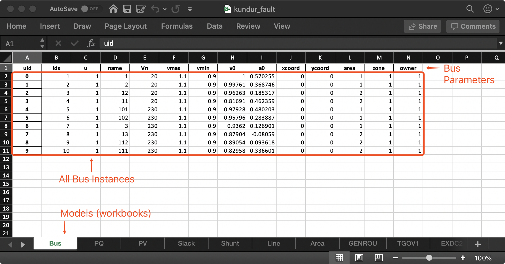

I/O Formats
===========

Input Formats
-------------

ANDES currently supports the following input formats:

- ANDES Excel (.xlsx)
- PSS/E RAW (.raw) and DYR (.dyr)
- MATPOWER (.m)

ANDES xlsx Format
-----------------

The ANDES xlsx format is a newly introduced format since v0.8.0.
This format uses Microsoft Excel for conveniently viewing and editing model parameters.
You can use `LibreOffice <https://www.libreoffice.org>`_ or `WPS Office <https://www.wps.com/>`_ alternatively to
Microsoft Excel.

xlsx Format Definition
......................

The ANDES xlsx format contains multiple workbooks (tabs at the bottom).
Each workbook contains the parameters of all instances of the model, whose name is the workbook name.
The first row in a worksheet is used for the names of parameters available to the model.
Starting from the second row, each row corresponds to an instance with the parameters in the corresponding columns.
An example of the ``Bus`` workbook is shown in the following.

A few columns are used across all models, including ``uid``, ``idx``, ``name`` and ``u``.

- ``uid`` is an internally generated unique instance index. This column can be left empty if the xlsx file is
  being manually created. Exporting the xlsx file with ``--convert`` will automatically assign the ``uid``.
- ``idx`` is the unique instance index for referencing. An unique ``idx`` should be provided explicitly for each
  instance. Accepted types for ``idx`` include numbers and strings without spaces.
- ``name`` is the instance name.
- ``u`` is the connectivity status of the instance. Accepted values are 0 and 1. Unexpected behaviors may occur
  if other numerical values are assigned.

As mentioned above, ``idx`` is the unique index for an instance to be referenced.
For example, a PQ instance can reference a Bus instance so that the PQ is connected to the Bus.
This is done through providing the ``idx`` of the desired bus as the ``bus`` parameter of the PQ.

.. image:: xlsx-pq.png
   :width: 600
   :alt: Example workbook for PQ

In the example PQ workbook shown above, there are two PQ instances on buses with ``idx`` being 7 and 8,
respectively.

Convert to xlsx
...............
Please refer to the the ``--convert`` command for converting a recognized file to xlsx.
See Format Converter in the CLI tutorial.

Data Consistency
................

Input data needs to have consistent types for ``idx``.
Both string and numerical types are allowed
for ``idx``, but the original type and the referencing type must be the same.
Suppose we have a bus and a connected PQ.
The Bus device may use ``1`` or ``'1'`` as its ``idx``, as long as the
PQ device uses the same value for its ``bus`` parameter.

The ANDES xlsx reader will try to convert data into numerical types when possible.
This is especially relevant when the input ``idx`` is string literal of numbers,
the exported file will have them converted to numbers.
The conversion does not affect the consistency of data.

Parameter Check
...............
The following parameter checks are applied after converting input values to array:

- Any ``NaN`` values will raise a ``ValueError``
- Any ``inf`` will be replaced with :math:`10^{8}`, and ``-inf`` will be replaced with :math:`-10^{8}`.
