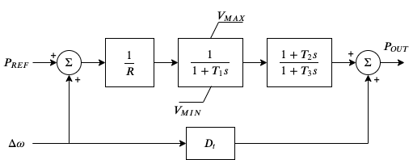
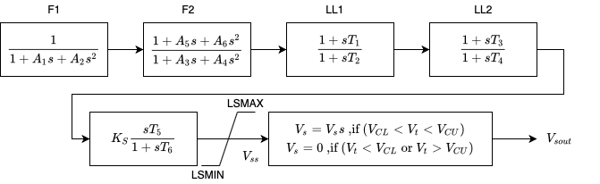

.. _modeling:

*****************
Modeling Cookbook
*****************

This chapter contains advanced topics on modeling and simulation and how they are implemented in ANDES.
It aims to provide an in-depth explanation of how the ANDES framework is set up for symbolic modeling and
numerical simulation. It also provides an example for interested users to implement customized DAE models.

System
======

Overview
--------
System is the top-level class for organizing power system models and orchestrating calculations.

.. autoclass:: andes.system.System
    :noindex:

.. note::
    `andes.System` is an alias of `andes.system.System`.

Dynamic Imports
```````````````
System dynamically imports groups, models, and routines at creation.
To add new models, groups or routines, edit the corresponding file by adding entries following examples.

.. autofunction:: andes.system.System.import_models
    :noindex:

.. autofunction:: andes.system.System.import_groups
    :noindex:

.. autofunction:: andes.system.System.import_routines
    :noindex:

Code Generation
```````````````
Under the hood, all symbolically defined equations need to be generated into anonymous function calls for
accelerating numerical simulations.
This process is automatically invoked for the first time ANDES is run command line.
It takes several seconds up to a minute to finish the generation.

.. note::
    Code generation has been done if one has executed ``andes``, ``andes selftest``, or ``andes prepare``.

.. warning::
    When models are modified (such as adding new models or changing equation strings), code generation needs
    to be executed again for consistency. It can be more conveniently triggered from command line with
    ``andes prepare -qi``.

.. autofunction:: andes.system.System.prepare
    :noindex:

Since the process is slow, generated numerical functions (Python Callable) will be serialized into a file
for future speed up.
The package used for serializing/de-serializing numerical calls is ``dill``.
System has a function called ``dill`` for serializing using the ``dill`` package.

.. autofunction:: andes.system.System.dill
    :noindex:

.. autofunction:: andes.system.System.undill
    :noindex:

DAE Storage
-----------

``System.dae`` is an instance of the numerical DAE class.

.. autofunction:: andes.variables.dae.DAE
    :noindex:

Model and DAE Values
--------------------
ANDES uses a decentralized architecture between models and DAE value arrays.
In this architecture, variables are initialized and equations are evaluated inside each model.
Then, ``System`` provides methods for collecting initial values and equation values into ``DAE``, as well as
copying solved values to each model.

The collection of values from models needs to follow protocols to avoid conflicts.
Details are given in the subsection Variables.

.. autofunction:: andes.system.System.vars_to_dae
    :noindex:

.. autofunction:: andes.system.System.vars_to_models
    :noindex:

.. autofunction:: andes.system.System._e_to_dae
    :noindex:

Matrix Sparsity Patterns
````````````````````````
The largest overhead in building and solving nonlinear equations is the building of Jacobian matrices.
This is especially relevant when we use the implicit integration approach which algebraized the differential
equations.
Given the unique data structure of power system models, the sparse matrices for Jacobians are built
**incrementally**, model after model.

There are two common approaches to incrementally build a sparse matrix. The first one is to use simple in-place
add on sparse matrices, such as doing ::

    self.fx += spmatrix(v, i, j, (n, n), 'd')

Although the implementation is simple, it involves creating and discarding temporary objects on the right hand
side and, even worse, changing the sparse pattern of ``self.fx``.

The second approach is to store the rows, columns and values in an array-like object and construct the Jacobians
at the end.
This approach is very efficient but has one caveat: it does not allow accessing the sparse matrix while building.

ANDES uses a pre-allocation approach to avoid the change of sparse patterns by filling values into a known the
sparse matrix pattern matrix.
System collects the indices of rows and columns for each Jacobian matrix.
Before in-place additions, ANDES builds a temporary zero-filled `spmatrix`, to which the actual Jacobian values
are written later.
Since these in-place add operations are only modifying existing values, it does not change the pattern and thus
avoids memory copying.
In addition, updating sparse matrices can be done with the exact same code as the first approach.

Still, this approach creates and discards temporary objects.
It is however feasible to write a C function which takes three array-likes and modify the sparse matrices in
place.
This is feature to be developed, and our prototype shows a promising acceleration up to 50%.

.. autofunction:: andes.system.System.store_sparse_pattern
    :noindex:

Calling Model Methods
---------------------

System is an orchestrator for calling shared methods of models. These API methods are defined
for initialization, equation update, Jacobian update, and discrete flags update.

The following methods take an argument `models`, which should be an `OrderedDict` of models with names as keys
and instances as values.

.. autofunction:: andes.system.System.init
    :noindex:

.. autofunction:: andes.system.System.e_clear
    :noindex:

.. autofunction:: andes.system.System.l_update_var
    :noindex:

.. autofunction:: andes.system.System.f_update
    :noindex:

.. autofunction:: andes.system.System.l_update_eq
    :noindex:

.. autofunction:: andes.system.System.g_update
    :noindex:

.. autofunction:: andes.system.System.j_update
    :noindex:


Configuration
-------------
System, models and routines have a member attribute `config` for model-specific or routine-specific configurations.
System manages all configs, including saving to a config file and loading back.

.. autofunction:: andes.system.System.get_config
    :noindex:

.. autofunction:: andes.system.System.save_config
    :noindex:

.. autofunction:: andes.system.System.load_config
    :noindex:

.. warning::

    It is important to note that configs from files is passed to *model constructors* during instantiation.
    If one needs to modify config for a run, it needs to be done before instantiating ``System``, or before running
    ``andes`` from command line.
    Directly modifying ``Model.config`` may not take effect or have side effect as for the current implementation.


Models
======
This section introduces the modeling of power system devices. The terminology "model" is used to describe the
mathematical representation of a *type* of device, such as synchronous generators or turbine governors. The
terminology "device" is used to describe a particular instance of a model, for example, a specific generator.

To define a model in ANDES, two classes, ``ModelData`` and ``Model`` need to be utilized. Class ``ModelData`` is
used for defining parameters that will be provided from input files. It provides API for adding data from
devices and managing the data.
Class ``Model`` is used for defining other non-input parameters, service
variables, and DAE variables. It provides API for converting symbolic equations, storing Jacobian patterns, and
updating equations.

Model Data
----------
.. autoclass:: andes.core.model.ModelData
    :noindex:

Cache
`````
`ModelData` uses a lightweight class :py:class:`andes.core.model.Cache` for caching its data as a dictionary
or a pandas DataFrame. Four attributes are defined in `ModelData.cache`:

- `dict`: all data in a dictionary with the parameter names as keys and `v` values as arrays.
- `dict_in`: the same as `dict` except that the values are from `v_in`, the original input.
- `df`: all data in a pandas DataFrame.
- `df_in`: the same as `df` except that the values are from `v_in`.

Other attributes can be added by registering with `cache.add_callback`.

.. autofunction:: andes.core.model.Cache.add_callback
    :noindex:

Define Voltage Ratings
``````````````````````
If a model is connected to an AC Bus or a DC Node, namely, if ``bus``, ``bus1``, ``node`` or ``node1`` exists
as parameter, it must provide the corresponding parameter, ``Vn``, ``Vn1``, ``Vdcn`` or ``Vdcn1``, for rated
voltages.

Controllers not connected to Bus or Node will have its rated voltages omitted and thus ``Vb = Vn = 1``, unless
one uses :py:class:`andes.core.param.ExtParam` to retrieve the bus/node values.

As a rule of thumb, controllers not directly connected to the network shall use system-base per unit for voltage
and current parameters.
Controllers (such as a turbine governor) may inherit rated power from controlled models and thus power parameters
will be converted consistently.


Define a DAE Model
--------------------
.. autoclass:: andes.core.model.Model
    :noindex:

Dynamicity Under the Hood
-------------------------
The magic for automatic creation of variables are all hidden in :py:func:`andes.core.model.Model.__setattr__`,
and the code is incredible simple.
It sets the name, tex_name, and owner model of the attribute instance and, more importantly,
does the book keeping.
In particular, when the attribute is a :py:class:`andes.core.block.Block` subclass, ``__setattr__`` captures the
exported instances, recursively, and prepends the block name to exported ones.
All these convenience owe to the dynamic feature of Python.

During the code generation phase, the symbols are created by checking the book-keeping attributes, such as
`states`, `algebs`, and attributes in `Model.cache`.

In the numerical evaluation phase, `Model` provides a method, :py:func:`andes.core.model.get_inputs`, to
collect the variable value arrays in a dictionary, which can be effortlessly passed as arguments to numerical
functions.

Commonly Used Attributes in Models
``````````````````````````````````
The following ``Model`` attributes are commonly used for debugging.
If the attribute is an `OrderedDict`, the keys are attribute names in str, and corresponding values are the
instances.

- ``params`` and ``params_ext``, two `OrderedDict` for internal (both numerical and non-numerical) and external
  parameters, respectively.
- ``num_params`` for numerical parameters, both internal and external.
- ``states`` and ``algebs``, two ``OrderedDict`` for state variables and algebraic variables, respectively.
- ``states_ext`` and ``algebs_ext``, two ``OrderedDict`` for external states and algebraics.
- ``discrete``, an `OrderedDict` for discrete components.
- ``blocks``, an `OrderedDict` for blocks.
- ``services``, an `OrderedDict` for services with ``v_str``.
- ``services_ext``, an `OrderedDict` for externally retrieved services.

Attributes in `Model.cache`
```````````````````````````
Attributes in `Model.cache` are additional book-keeping structures for variables, parameters and services.
The following attributes are defined.

- ``all_vars``: all the variables.
- ``all_vars_names``, a list of all variable names.
- ``all_params``, all parameters.
- ``all_params_names``, a list of all parameter names.
- ``algebs_and_ext``, an `OrderedDict` of internal and external algebraic variables.
- ``states_and_ext``, an `OrderedDict` of internal and external differential variables.
- ``services_and_ext``, an `OrderedDict` of internal and external service variables.
- ``vars_int``, an `OrderedDict` of all internal variables, states and then algebs.
- ``vars_ext``, an `OrderedDict` of all external variables, states and then algebs.

Equation Generation
-------------------
``Model.syms``, an instance of ``SymProcessor``, handles the symbolic to numeric generation when called. The
equation generation is a multi-step process with symbol preparation, equation generation, Jacobian generation,
initializer generation, and pretty print generation.

.. autoclass:: andes.core.model.SymProcessor
    :members: generate_symbols, generate_equations, generate_jacobians, generate_init
    :noindex:

Next, function ``generate_equation`` converts each DAE equation set to one numerical function calls and store
it in ``Model.calls``. The attributes for differential equation set and algebraic equation set are ``f``
and ``g``. Differently, service variables will be generated one by one and store in an ``OrderedDict``
in ``Model.calls.s``.


Jacobian Storage
----------------

Abstract Jacobian Storage
`````````````````````````
Using the ``.jacobian`` method on ``sympy.Matrix``, the symbolic Jacobians can be easily obtained. The complexity
lies in the storage of the Jacobian elements. Observed that the Jacobian equation generation happens before any
system is loaded, thus only the variable indices in the variable array is available. For each non-zero item in each
Jacobian matrix, ANDES stores the equation index, variable index, and the Jacobian value (either a constant
number or a callable function returning an array).

Note that, again, a non-zero entry in a Jacobian matrix can be either a constant or an expression. For efficiency,
constant numbers and lambdified callables are stored separately. Constant numbers, therefore, can be loaded into
the sparse matrix pattern when a particular system is given.

.. warning::

    Data structure for the Jacobian storage has changed. Pending documentation update. Please check
    :py:mod:`andes.core.common.JacTriplet` class for more details.

The triplets, the equation (row) index, variable (column) index, and values (constant numbers or callable) are
stored in ``Model`` attributes with the name of ``_{i, j, v}{Jacobian Name}{c or None}``, where
``{i, j, v}`` is a single character for row, column or value, ``{Jacobian Name}`` is a two-character Jacobian
name chosen from ``fx, fy, gx, and gy``, and ``{c or None}`` is either character ``c`` or no character,
indicating whether it corresponds to the constants or non-constants in the Jacobian.

For example, the triplets for the
constants in Jacobian ``gy`` are stored in ``_igyc``, ``_jgyc``, and ``_vgyc``.

In terms of the non-constant entries in Jacobians, the callable functions are stored in the corresponding
``_v{Jacobian Name}`` array. Note the differences between, for example, ``_vgy`` an ``_vgyc``: ``_vgy`` is a
list of callables, while ``_vgyc`` is a list of constant numbers.

Concrete Jacobian Storage
`````````````````````````
When a specific system is loaded and the addresses are assigned to variables, the abstract Jacobian triplets,
more specifically, the rows and columns, are replaced with the array of addresses. The new addresses and values
will be stored in ``Model`` attributes with the names ``{i, j, v}{Jacobian Name}{c or None}``. Note that there
is no underscore for the concrete Jacobian triplets.

For example, if model ``PV`` has a list of variables ``[p, q, a, v]`` .
The equation associated with ``p`` is ``- u * p0``, and the equation associated with ``q`` is ``u * (v0 - v)``.
Therefore, the derivative of equation ``v0 - v`` over ``v`` is ``-u``. Note that ``u`` is unknown at generation
time, thus the value is NOT a constant and should to go ``vgy``.

The values in ``_igy``, ``_jgy`` and ``_vgy`` contains, respectively, ``1``, ``3``, and a lambda function which
returns ``-u``.

When a specific system is loaded, for example, a 5-bus system, the addresses for the ``q`` and ``v`` are ``[11,
13, 15``, and ``[5, 7, 9]``.
``PV.igy`` and ``PV.jgy`` will thus query the corresponding address list based on ``PV._igy`` and ``PV._jgy``
and store ``[11, 13, 15``, and ``[5, 7, 9]``.

Initialization
--------------
Value providers such as services and DAE variables need to be initialized. Services are initialized before
any DAE variable. Both Services and DAE Variables are initialized *sequentially* in the order of declaration.

Each Service, in addition to the standard ``v_str`` for symbolic initialization, provides a ``v_numeric`` hook
for specifying a custom function for initialization. Custom initialization functions for DAE variables, are
lumped in a single function in ``Model.v_numeric``.

ANDES has an *experimental* Newton-Krylov method based iterative initialization. All DAE variables with ``v_iter``
will be initialized using the iterative approach

Additional Numerical Equations
------------------------------
Addition numerical equations are allowed to complete the "hybrid symbolic-numeric" framework. Numerical function
calls are useful when the model DAE is non-standard or hard to be generalized. Since the
symbolic-to-numeric generation is an additional layer on top of the numerical simulation, it is fundamentally
the same as user-provided numerical function calls.

ANDES provides the following hook functions in each ``Model`` subclass for custom numerical functions:

- ``v_numeric``: custom initialization function
- ``s_numeric``: custom service value function
- ``g_numeric``: custom algebraic equations; update the ``e`` of the corresponding variable.
- ``f_numeric``: custom differential equations; update the ``e`` of the corresponding variable.
- ``j_numeric``: custom Jacobian equations; the function should append to ``_i``, ``_j`` and ``_v`` structures.

For most models, numerical function calls are unnecessary and not recommended as it increases code complexity.
However, when the data structure or the DAE are difficult to generalize in the symbolic framework, the numerical
equations can be used.

For interested readers, see the ``COI`` symbolic implementation which calculated the
center-of-inertia speed of generators. The ``COI`` could have been implemented numerically with for loops
instead of ``NumReduce``, ``NumRepeat`` and external variables.

..
    Atoms
    ANDES defines several types of atoms for building DAE models, including parameters, DAE variables,
    and service variables. Atoms can be used to build models and libraries, combined with discrete
    components and blocks.


Atom Types
============
ANDES contains three types of atom classes for building DAE models.
These types are parameter, variable and service.

Value Provider
--------------

Before addressing specific atom classes, the terminology `v-provider`, and `e-provider` are discussed.
A value provider class (or `v-provider` for short) references any class with a member attribute named ``v``,
which should be a list or a 1-dimensional array of values.
For example, all parameter classes are v-providers, since a parameter class should provide
values for that parameter.

.. note::
    In fact, all types of atom classes are v-providers, meaning that an instance of an atom class must contain values.

The values in the `v` attribute of a particular instance are values that will substitute the instance for computation.
If in a model, one has a parameter ::

    self.v0 = NumParam()
    self.b = NumParam()

    # where self.v0.v = np.array([1., 1.05, 1.1]
    #   and self.b.v  = np.array([10., 10., 10.]

Later, this parameter is used in an equation, such as ::

    self.v = ExtAlgeb(model='Bus', src='v',
                      indexer=self.bus,
                      e_str='v0 **2 * b')

While computing `v0 ** 2 * b`, `v0` and `b` will be substituted with the values in `self.v0.v` and `self.b.v`.

Sharing this interface `v` allows interoperability among parameters and variables and services.
In the above example, if one defines `v0` as a `ConstService` instance, such as ::

    self.v0 = ConstService(v_str='1.0')

Calculations will still work without modification.

Equation Provider
-----------------
Similarly, an equation provider class (or `e-provider`) references any class with a member attribute named ``e``,
which should be a 1-dimensional array of values.
The values in the `e` array are the results from the equation and will be summed to the numerical DAE at the addresses
specified by the attribute `a`.

.. note::
    Currently, only variables are `e-provider` types.

If a model has an external variable that links to Bus.v (voltage), such as ::

    self.v = ExtAlgeb(model='Bus', src='v',
                      indexer=self.bus,
                      e_str='v0 **2 * b')

The addresses of the corresponding voltage variables will be retrieved into `self.a`,
and the equation evaluation results will be stored in `self.v.e`

Parameters
==========

Background
-----------

Parameter is a type of building atom for DAE models.
Most parameters are read directly from an input file and passed to equation,
and other parameters can be calculated from existing parameters.

The base class for parameters in ANDES is `BaseParam`, which defines interfaces for adding values and
checking the number of values. `BaseParam` has its values stored in a plain list, the member attribute `v`.
Subclasses such as `NumParam` stores values using a NumPy ndarray.

An overview of supported parameters is given below.

+---------------+----------------------------------------------------------------------------+
|  Subclasses   |     Description                                                            |
+===============+============================================================================+
|  DataParam    | An alias of `BaseParam`. Can be used for any non-numerical parameters.     |
+---------------+----------------------------------------------------------------------------+
|  NumParam     | The numerical parameter type. Used for all parameters in equations         |
+---------------+----------------------------------------------------------------------------+
|  IdxParam     | The parameter type for storing `idx` into other models                     |
+---------------+----------------------------------------------------------------------------+
|  ExtParam     | Externally defined parameter                                               |
+---------------+----------------------------------------------------------------------------+
|  TimerParam   | Parameter for storing the action time of events                            |
+---------------+----------------------------------------------------------------------------+

Data Parameters
---------------
.. autoclass:: andes.core.param.BaseParam
    :noindex:

.. autoclass:: andes.core.param.DataParam
    :noindex:

.. autoclass:: andes.core.param.IdxParam
    :noindex:

Numeric Parameters
------------------
.. autoclass:: andes.core.param.NumParam
    :noindex:

External Parameters
-------------------
.. autoclass:: andes.core.param.ExtParam
    :noindex:

Timer Parameter
---------------
.. autoclass:: andes.core.param.TimerParam
    :noindex:


Variables
=========
DAE Variables, or variables for short, are unknowns to be solved using numerical or analytical methods.
A variable stores values, equation values, and addresses in the DAE array. The base class for variables is
`BaseVar`.
In this subsection, `BaseVar` is used to represent any subclass of `VarBase` list in the table below.

+-----------+---------------------------------------------------------------------------------------+
|   Class   |                                      Description                                      |
+===========+=======================================================================================+
|  State    | A state variable and associated diff. equation :math:`\textbf{T} \dot{x} = \textbf{f}`|
+-----------+---------------------------------------------------------------------------------------+
|  Algeb    | An algebraic variable and an associated algebraic equation :math:`0 = \textbf{g}`     |
+-----------+---------------------------------------------------------------------------------------+
|  ExtState | An external state variable and part of the differential equation (uncommon)           |
+-----------+---------------------------------------------------------------------------------------+
|  ExtAlgeb | An external algebraic variable and part of the algebraic equation                     |
+-----------+---------------------------------------------------------------------------------------+

`BaseVar` has two types: the differential variable type `State` and the algebraic variable type `Algeb`.
State variables are described by differential equations, whereas algebraic variables are described by
algebraic equations. State variables can only change continuously, while algebraic variables
can be discontinuous.

Based on the model the variable is defined, variables can be internal or external. Most variables are internal
and only appear in equations in the same model.
Some models have "public" variables that can be accessed by other
models. For example, a `Bus` defines `v` for the voltage magnitude.
Each device attached to a particular bus needs to access the value and impose the reactive power injection.
It can be done with `ExtAlgeb` or `ExtState`, which links with an existing variable from a model or a group.

Variable, Equation and Address
------------------------------
Subclasses of `BaseVar` are value providers and equation providers.
Each `BaseVar` has member attributes `v` and `e` for variable values and equation values, respectively.
The initial value of `v` is set by the initialization routine, and the initial value of `e` is set to zero.
In the process of power flow calculation or time domain simulation, `v` is not directly modifiable by models
but rather updated after solving non-linear equations. `e` is updated by the models and summed up before
solving equations.

Each `BaseVar` also stores addresses of this variable, for all devices, in its member attribute `a`. The
addresses are *0-based* indices into the numerical DAE array, `f` or `g`, based on the variable type.

For example, `Bus` has ``self.a = Algeb()`` as the voltage phase angle variable.
For a 5-bus system, ``Bus.a.a`` stores the addresses of the `a` variable for all
the five Bus devices. Conventionally, `Bus.a.a` will be assigned `np.array([0, 1, 2, 3, 4])`.

Value and Equation Strings
--------------------------
The most important feature of the symbolic framework is allowing to define equations using strings.
There are three types of strings for a variable, stored in the following member attributes, respectively:

- `v_str`: equation string for **explicit** initialization in the form of `v = v_str(x, y)`.
- `v_iter`: equation string for **implicit** initialization in the form of `v_iter(x, y) = 0`
- `e_str`: equation string for (full or part of) the differential or algebraic equation.

The difference between `v_str` and `v_iter` should be clearly noted. `v_str` evaluates directly into the
initial value, while all `v_iter` equations are solved numerically using the Newton-Krylov iterative method.

Values Between DAE and Models
-----------------------------
ANDES adopts a decentralized architecture which provides each model a copy of variable values before equation
evaluation. This architecture allows to parallelize the equation evaluation (in theory, or in practice if one
works round the Python GIL). However, this architecture requires a coherent protocol for updating the DAE arrays
and the ``BaseVar`` arrays. More specifically, how the variable and equations values from model ``VarBase``
should be summed up or forcefully set at the DAE arrays needs to be defined.

The protocol is relevant when a model defines subclasses of `BaseVar` that are supposed to be "public".
Other models share this variable with `ExtAlgeb` or `ExtState`.

By default, all `v` and `e` at the same address are summed up.
This is the most common case, such as a Bus connected by multiple devices: power injections from
devices should be summed up.

In addition, `BaseVar` provides two flags, `v_setter` and `e_setter`, for cases when one `VarBase`
needs to overwrite the variable or equation values.

Flags for Value Overwriting
---------------------------
`BaseVar` have special flags for handling value initialization and equation values.
This is only relevant for public or external variables.
The `v_setter` is used to indicate whether a particular `BaseVar` instance sets the initial value.
The `e_setter` flag indicates whether the equation associated with a `BaseVar` sets the equation value.

The `v_setter` flag is checked when collecting data from models to the numerical DAE array. If
`v_setter is False`, variable values of the same address will be added.
If one of the variable or external variable has `v_setter is True`, it will, at the end, set the values in the
DAE array to its value. Only one `BaseVar` of the same address is allowed to have `v_setter == True`.

A `v_setter` Example
------------------------
A Bus is allowed to default the initial voltage magnitude to 1 and the voltage phase angle to 0.
If a PV device is connected to a Bus device, the PV should be allowed to override the voltage initial value
with the voltage set point.

In `Bus.__init__()`, one has ::

    self.v = Algeb(v_str='1')

In `PV.__init__`, one can use ::

    self.v0 = Param()
    self.bus = IdxParam(model='Bus')

    self.v = ExtAlgeb(src='v',
                      model='Bus',
                      indexer=self.bus,
                      v_str='v0',
                      v_setter=True)

where an `ExtAlgeb` is defined to access `Bus.v` using indexer `self.bus`. The `v_str` line sets the
initial value to `v0`. In the variable initialization phase for `PV`, `PV.v.v` is set to `v0`.

During the value collection into `DAE.y` by the `System` class, `PV.v`, as a final `v_setter`, will
overwrite the voltage magnitude for Bus devices with the indices provided in `PV.bus`.

.. autoclass:: andes.core.var.BaseVar
    :noindex:

.. autoclass:: andes.core.var.ExtVar
    :noindex:

.. autoclass:: andes.core.var.State
    :noindex:

.. autoclass:: andes.core.var.Algeb
    :noindex:

.. autoclass:: andes.core.var.ExtState
    :noindex:

.. autoclass:: andes.core.var.ExtAlgeb
    :noindex:

.. autoclass:: andes.core.var.AliasState
    :noindex:

.. autoclass:: andes.core.var.AliasAlgeb
    :noindex:

Services
========
Services are helper variables outside the DAE variable list. Services are most often used for storing intermediate
constants but can be used for special operations to work around restrictions in the symbolic framework.
Services are value providers, meaning each service has an attribute ``v`` for storing service values. The
base class of services is ``BaseService``, and the supported services are listed as follows.

+------------------+-----------------------------------------------------------------+
|      Class       |                           Description                           |
+==================+=================================================================+
|  ConstService    | Internal service for constant values.                           |
+------------------+-----------------------------------------------------------------+
|  VarService      | Variable service updated at each iteration before equations.    |
+------------------+-----------------------------------------------------------------+
|  ExtService      | External service for retrieving values from value providers.    |
+------------------+-----------------------------------------------------------------+
|  PostInitService | Constant service evaluated after TDS initialization             |
+------------------+-----------------------------------------------------------------+
|  NumReduce       | The service type for reducing linear 2-D arrays into 1-D arrays |
+------------------+-----------------------------------------------------------------+
|  NumRepeat       | The service type for repeating a 1-D array to linear 2-D arrays |
+------------------+-----------------------------------------------------------------+
|  IdxRepeat       | The service type for repeating a 1-D list to linear 2-D list    |
+------------------+-----------------------------------------------------------------+
|  EventFlag       | Service type for flagging changes in inputs as an event         |
+------------------+-----------------------------------------------------------------+
|  VarHold         | Hold input value when a hold signal is active                   |
+------------------+-----------------------------------------------------------------+
|  ExtendedEvent   | Extend an event signal for a given period of time               |
+------------------+-----------------------------------------------------------------+
|  DataSelect      | Select optional str data if provided or use the fallback        |
+------------------+-----------------------------------------------------------------+
|  NumSelect       | Select optional numerical data if provided                      |
+------------------+-----------------------------------------------------------------+
|  DeviceFinder    | Finds or creates devices linked to the given devices            |
+------------------+-----------------------------------------------------------------+
|  BackRef         | Collects idx-es for the backward references                     |
+------------------+-----------------------------------------------------------------+
|  RefFlatten      | Converts BackRef list of lists into a 1-D list                  |
+------------------+-----------------------------------------------------------------+
|  InitChecker     | Checks initial values against typical values                    |
+------------------+-----------------------------------------------------------------+
|  FlagValue       | Flags values that equals the given value                        |
+------------------+-----------------------------------------------------------------+
|  Replace         | Replace values that returns True for the given lambda func      |
+------------------+-----------------------------------------------------------------+


Internal Constants
---------------------------
The most commonly used service is `ConstService`.  It is used to store an array of constants, whose value is
evaluated from a provided symbolic string. They are only evaluated once in the model initialization phase, ahead
of variable initialization. `ConstService` comes handy when one wants to calculate intermediate constants from
parameters.

For example, a turbine governor has a `NumParam` `R` for the
droop. `ConstService` allows to calculate the inverse of the droop, the gain, and use it in equations. The
snippet from a turbine governor's ``__init__()`` may look like ::

    self.R = NumParam()
    self.G = ConstService(v_str='u/R')

where `u` is the online status parameter. The model can thus use `G` in subsequent variable or equation
strings.

.. autoclass:: andes.core.service.ConstService
    :noindex:

.. autoclass:: andes.core.service.VarService
    :noindex:

.. autoclass:: andes.core.service.PostInitService
    :noindex:

External Constants
------------------------
Service constants whose value is retrieved from an external model or group. Using `ExtService` is
similar to using external variables. The values of `ExtService` will be retrieved once during the
initialization phase before `ConstService` evaluation.

For example, a synchronous generator needs to retrieve the `p` and `q` values from static generators
for initialization. `ExtService` is used for this purpose. In the ``__init__()`` of a synchronous generator
model, one can define the following to retrieve `StaticGen.p` as `p0`::

        self.p0 = ExtService(src='p',
                             model='StaticGen',
                             indexer=self.gen,
                             tex_name='P_0')

.. autoclass:: andes.core.service.ExtService
    :noindex:

Shape Manipulators
-------------------------------------------
This section is for advanced model developer.

All generated equations operate on 1-dimensional arrays and can use algebraic calculations only.
In some cases, one model would use `BackRef` to retrieve 2-dimensional indices and will use such indices to
retrieve variable addresses.
The retrieved addresses usually has a different length of the referencing model and cannot be used directly for calculation.
Shape manipulator services can be used in such case.

`NumReduce` is a helper Service type which reduces a linearly stored 2-D ExtParam into 1-D Service.
`NumRepeat` is a helper Service type which repeats a 1-D value into linearly stored 2-D value based on the
shape from a `BackRef`.

.. autoclass:: andes.core.service.BackRef
    :noindex:

.. autoclass:: andes.core.service.NumReduce
    :noindex:

.. autoclass:: andes.core.service.NumRepeat
    :noindex:

.. autoclass:: andes.core.service.IdxRepeat
    :noindex:

.. autoclass:: andes.core.service.RefFlatten
    :noindex:


Value Manipulation
------------------
.. autoclass:: andes.core.service.Replace
    :noindex:

.. autoclass:: andes.core.service.FlagValue
    :noindex:


Idx and References
-------------------------------------------
.. autoclass:: andes.core.service.DeviceFinder
    :noindex:

.. autoclass:: andes.core.service.BackRef
    :noindex:

.. autoclass:: andes.core.service.RefFlatten
    :noindex:


Events
----------
.. autoclass:: andes.core.service.EventFlag
    :noindex:

.. autoclass:: andes.core.service.ExtendedEvent
    :noindex:


Data Select
-----------
.. autoclass:: andes.core.service.DataSelect
    :noindex:

.. autoclass:: andes.core.service.NumSelect
    :noindex:


Miscellaneous
-------------
.. autoclass:: andes.core.service.InitChecker
    :noindex:


Discrete
========

Background
----------
The discrete component library contains a special type of block for modeling the discontinuity in power system
devices. Such continuities can be device-level physical constraints or algorithmic limits imposed on controllers.

The base class for discrete components is :py:mod:`andes.core.discrete.Discrete`.

.. autoclass:: andes.core.discrete.Discrete
    :noindex:

The uniqueness of discrete components is the way it works.
Discrete components take inputs, criteria, and exports a set of flags with the component-defined meanings.
These exported flags can be used in algebraic or differential equations to build piece-wise equations.

For example, `Limiter` takes a v-provider as input, two v-providers as the upper and the lower bound.
It exports three flags: `zi` (within bound), `zl` (below lower bound), and `zu` (above upper bound).
See the code example in ``models/pv.py`` for an example voltage-based PQ-to-Z conversion.

It is important to note when the flags are updated.
Discrete subclasses can use three methods to check and update the value and equations.
Among these methods, `check_var` is called *before* equation evaluation, but `check_eq` and `set_eq` are
called *after* equation update.
In the current implementation, `check_var` updates flags for variable-based discrete components (such as
`Limiter`).
`check_eq` updates flags for equation-involved discrete components (such as `AntiWindup`).
`set_var`` is currently only used by `AntiWindup` to store the pegged states.

ANDES includes the following types of discrete components.

Limiters
--------
.. autoclass:: andes.core.discrete.Limiter
    :noindex:

.. autoclass:: andes.core.discrete.SortedLimiter
    :noindex:

.. autoclass:: andes.core.discrete.HardLimiter
    :noindex:

.. autoclass:: andes.core.discrete.AntiWindup
    :noindex:

Comparers
---------
.. autoclass:: andes.core.discrete.LessThan
    :noindex:

.. autoclass:: andes.core.discrete.Selector
    :noindex:

.. autoclass:: andes.core.discrete.Switcher
    :noindex:

Deadband
--------
.. autoclass:: andes.core.discrete.DeadBand
    :noindex:

Blocks
======

Background
----------
The block library contains commonly used blocks (such as transfer functions and nonlinear functions).
Variables and equations are pre-defined for blocks to be used as "lego pieces" for scripting DAE models.
The base class for blocks is :py:mod:`andes.core.block.Block`.

The supported blocks include ``Lag``, ``LeadLag``, ``Washout``, ``LeadLagLimit``, ``PIController``. In addition,
the base class for piece-wise nonlinear functions, ``PieceWise`` is provided. ``PieceWise`` is used for
implementing the quadratic saturation function ``MagneticQuadSat`` and exponential saturation function
``MagneticExpSat``.

All variables in a block must be defined as attributes in the constructor, just like variable definition in
models. The difference is that the variables are "exported" from a block to the capturing model. All exported
variables need to placed in a dictionary, ``self.vars`` at the end of the block constructor.

Blocks can be nested as advanced usage. See the following API documentation for more details.

.. autoclass:: andes.core.block.Block
    :noindex:

Transfer Functions
------------------

The following transfer function blocks have been implemented.
They can be imported to build new models.

Algebraic
`````````
.. autoclass:: andes.core.block.Gain
    :members: define
    :noindex:

First Order
```````````
.. autoclass:: andes.core.block.Integrator
    :members: define
    :noindex:

.. autoclass:: andes.core.block.IntegratorAntiWindup
    :members: define
    :noindex:

.. autoclass:: andes.core.block.Lag
    :members: define
    :noindex:

.. autoclass:: andes.core.block.LagAntiWindup
    :members: define
    :noindex:

.. autoclass:: andes.core.block.Washout
    :members: define
    :noindex:

.. autoclass:: andes.core.block.WashoutOrLag
    :members: define
    :noindex:

.. autoclass:: andes.core.block.LeadLag
    :members: define
    :noindex:

.. autoclass:: andes.core.block.LeadLagLimit
    :members: define
    :noindex:

Second Order
````````````
.. autoclass:: andes.core.block.Lag2ndOrd
    :members: define
    :noindex:

.. autoclass:: andes.core.block.LeadLag2ndOrd
    :members: define
    :noindex:

Saturation
----------
.. autoclass:: andes.models.exciter.ExcExpSat
    :members: define
    :noindex:


Others
------

Value Selector
``````````````
.. autoclass:: andes.core.block.HVGate
    :noindex:

.. autoclass:: andes.core.block.LVGate
    :noindex:


Examples
========
We show two examples to demonstrate modeling from equations and modeling from
control block diagrams.

- The TGOV1 example shows code snippet for equation-based modeling
  and, as well as code for block-based modeling.
- The IEEEST example walks through the source code and explains the complete
  setup, including optional parameters, input selection, and manual per-unit
  conversion.

TGOV1
-----
The TGOV1_ turbine governor model is shown as a practical example using the library.



This model is composed of a lead-lag transfer function and a first-order lag transfer function
with an anti-windup limiter, which are sufficiently complex for demonstration.
The corresponding differential equations and algebraic equations are given below.

.. math::

    \left[
    \begin{matrix}
    \dot{x}_{LG} \\
    \dot{x}_{LL}
    \end{matrix}
    \right]
    =
    \left[
    \begin{matrix}z_{i,lim}^{LG} \left(P_{d} - x_{LG}\right) / {T_1}
    \\
    \left(x_{LG} - x_{LL}\right) / T_3
    \end{matrix}
    \right]

    \left[
    \begin{matrix}
    0 \\
    0 \\
    0 \\
    0 \\
    0 \\
    0
    \end{matrix}
    \right]
    =
    \left[
    \begin{matrix}
    (1 - \omega) - \omega_{d} \\
    R \times \tau_{m0} - P_{ref} \\
    \left(P_{ref} + \omega_{d}\right)/R - P_{d}\\
    D_{t} \omega_{d} + y_{LL}  - P_{OUT}\\
    \frac{T_2}{T_3} \left(x_{LG} - x_{LL}\right) + x_{LL} - y_{LL}\\
    u \left(P_{OUT} - \tau_{m0}\right)
    \end{matrix}
    \right]

where *LG* and *LL* denote the lag block and the lead-lag block, :math:`\dot{x}_{LG}` and :math:`\dot{x}_{LL}`
are the internal states, :math:`y_{LL}` is the lead-lag output, :math:`\omega` the generator speed,
:math:`\omega_d` the generator under-speed, :math:`P_d` the droop output, :math:`\tau_{m0}` the steady-state
torque input, and :math:`P_{OUT}` the turbine output that will be summed at the generator.

The code to describe the above model using equations is given below.
The complete code can be found in class ``TGOV1ModelAlt`` in
``andes/models/governor.py``.

.. code:: python

    def __init__(self, system, config):
      # 1. Declare parameters from case file inputs.
      self.R = NumParam(info='Turbine governor droop',
                        non_zero=True, ipower=True)
      # Other parameters are omitted.

      # 2. Declare external variables from generators.
      self.omega = ExtState(src='omega',
                     model='SynGen',
                     indexer=self.syn,
                     info='Generator speed')
      self.tm = ExtAlgeb(src='tm',
                  model='SynGen',
                  indexer=self.syn,
                  e_str='u*(pout-tm0)',
                  info='Generator torque input')

      # 3. Declare initial values from generators.
      self.tm0 = ExtService(src='tm',
                   model='SynGen',
                   indexer=self.syn,
                   info='Initial torque input')

      # 4. Declare variables and equations.
      self.pref = Algeb(info='Reference power input',
                    v_str='tm0*R',
                    e_str='tm0*R-pref')
      self.wd = Algeb(info='Generator under speed',
                  e_str='(1-omega)-wd')
      self.pd = Algeb(info='Droop output',
                  v_str='tm0',
                  e_str='(wd+pref)/R-pd')
      self.LG_x = State(info='State in the lag TF',
                    v_str='pd',
                    e_str='LG_lim_zi*(pd-LG_x)/T1')
      self.LG_lim = AntiWindup(u=self.LG_x,
                      lower=self.VMIN,
                      upper=self.VMAX)
      self.LL_x = State(info='State in the lead-lag TF',
                    v_str='LG_x',
                    e_str='(LG_x-LL_x)/T3')
      self.LL_y = Algeb(info='Lead-lag Output',
                    v_str='LG_x',
                    e_str='T2/T3*(LG_x-LL_x)+LL_x-LL_y')
      self.pout = Algeb(info='Turbine output power',
                    v_str='tm0',
                    e_str='(LL_y+Dt*wd)-pout')


Another implementation of TGOV1_ makes extensive use of the modeling blocks.
The resulting code is more readable as follows.

.. code:: python

    def __init__(self, system, config):
        TGBase.__init__(self, system, config)

        self.gain = ConstService(v_str='u/R')

        self.pref = Algeb(info='Reference power input',
                          tex_name='P_{ref}',
                          v_str='tm0 * R',
                          e_str='tm0 * R - pref',
                          )

        self.wd = Algeb(info='Generator under speed',
                        unit='p.u.',
                        tex_name=r'\omega_{dev}',
                        v_str='0',
                        e_str='(wref - omega) - wd',
                        )
        self.pd = Algeb(info='Pref plus under speed times gain',
                        unit='p.u.',
                        tex_name="P_d",
                        v_str='u * tm0',
                        e_str='u*(wd + pref + paux) * gain - pd')

        self.LAG = LagAntiWindup(u=self.pd,
                                 K=1,
                                 T=self.T1,
                                 lower=self.VMIN,
                                 upper=self.VMAX,
                                 )

        self.LL = LeadLag(u=self.LAG_y,
                          T1=self.T2,
                          T2=self.T3,
                          )

        self.pout.e_str = '(LL_y + Dt * wd) - pout'

The complete code can be found in class ``TGOV1Model`` in ``andes/models/governor.py``.

IEEEST
------
In this example, we will explain step-by-step how IEEEST_ is programmed.
The block diagram of IEEEST is given as follows.
We recommend you to open up the source code in ``andes/models/pss.py`` and
then continue reading.



First of all, modeling components are imported at the beginning.

Next, ``PSSBaseData`` is defined to hold parameters shared by all PSSs.
``PSSBaseData`` inherits from ``ModelData`` and calls the base constructor.
There is only one field ``avr`` defined for the linked exciter idx.

Then, ``IEEESTData`` defines the input parameters for IEEEST.
Use ``IdxParam`` for fields that store idx-es of devices that IEEEST devices link to.
Use ``NumParam`` for numerical parameters.

PSSBase
```````
``PSSBase`` is defined for the common (external) parameters, services and variables
shared by all PSSs.
The class and constructor signatures are

.. code:: python

    class PSSBase(Model):
        def __init__(self, system, config):
            super().__init__(system, config)

``PSSBase`` inherits from ``Model`` and calls the base constructor.
Note that the call to ``Model``'s constructor takes two positional arguments, ``system``
and ``config`` of types ``System`` and ``ModelConfig``.
Next, the group is specified, and the model flags are set.

.. code:: python

        self.group = 'PSS'
        self.flags.update({'tds': True})

Next, ``Replace`` is used to replace input parameters that satisfy a lambda function
with new values.

.. code:: python

        self.VCUr = Replace(self.VCU, lambda x: np.equal(x, 0.0), 999)
        self.VCLr = Replace(self.VCL, lambda x: np.equal(x, 0.0), -999)

The value replacement happens when ``VCUr`` and ``VCLr`` is first accessed.
``Replace`` is executed in the model initialization phase (at the end of
services update).

Next, the indices of connected generators, buses, and bus frequency measurements
are retrieved.
Synchronous generator idx is retrieved with

.. code:: python

        self.syn = ExtParam(model='Exciter', src='syn', indexer=self.avr, export=False,
                            info='Retrieved generator idx', dtype=str)

Using the retrieved ``self.syn``, it retrieves the buses to which
the generators are connected.

.. code:: python

        self.bus = ExtParam(model='SynGen', src='bus', indexer=self.syn, export=False,
                            info='Retrieved bus idx', dtype=str, default=None,
                            )

PSS models support an optional remote bus specified through parameter ``busr``.
When ``busr`` is ``None``, the generator-connected bus should be used.
The following code uses ``DataSelect`` to select ``busr`` if available but falls
back to ``bus`` otherwise.

.. code:: python

        self.buss = DataSelect(self.busr, self.bus, info='selected bus (bus or busr)')

Each PSS links to a bus frequency measurement device.
If the input data does not specify one or the specified one does not exist,
``DeviceFinder`` can find the correct measurement device for the bus
where frequency measurements should be taken.

.. code:: python

        self.busfreq = DeviceFinder(self.busf, link=self.buss, idx_name='bus')

where ``busf`` is the optional frequency measurement device idx, ``buss`` is the bus idx
for which measurement device needs to be found or created.

Next, external parameters, variables and services are retrieved.
Note that the PSS output ``vsout`` is pre-allocated but the equation string
is left to specific models.

IEEESTModel
```````````
``IEEESTModel`` inherits from ``PSSBase`` and adds specific model components.
After calling ``PSSBase``'s constructor, IEEESTModel adds config entries
to allow specifying the model for frequency measurement, because
there may be multiple frequency measurement models in the future.

.. code:: python

        self.config.add(OrderedDict([('freq_model', 'BusFreq')]))
        self.config.add_extra('_help', {'freq_model': 'default freq. measurement model'})
        self.config.add_extra('_alt', {'freq_model': ('BusFreq',)})

We set the chosen measurement model to ``busf`` so that ``DeviceFinder`` knows which
model to use if it needs to create new devices.

.. code:: python

        self.busf.model = self.config.freq_model

Next, because bus voltage is an algebraic variable, we use ``Derivative`` to calculate
the finite difference to approximate its derivative.

.. code:: python

        self.dv = Derivative(self.v, tex_name='dV/dt', info='Finite difference of bus voltage')

Then, we retrieve the coefficient to convert power from machine base to system base
using ``ConstService``, given by Sb / Sn.
This is needed for input mode 3, electric power in machine base.

.. code:: python

        self.SnSb = ExtService(model='SynGen', src='M', indexer=self.syn, attr='pu_coeff',
                               info='Machine base to sys base factor for power',
                               tex_name='(Sb/Sn)')

Note that the ``ExtService`` access the ``pu_coeff`` field of the ``M`` variables of
synchronous generators.
Since ``M`` is a machine-base power quantity, ``M.pu_coeff`` stores the multiplication coefficient
to convert each of them from machine bases to the system base, which is Sb / Sn.

The input mode is parsed into boolean flags using ``Switcher``:

.. code:: python

        self.SW = Switcher(u=self.MODE,
                           options=[0, 1, 2, 3, 4, 5, 6],
                           )

where the input ``u`` is the MODE parameter, and ``options`` is a list of accepted
values.
``Switcher`` boolean arrays ``s0``, ``s1``, ..., ``sN``, where ``N = len(options) - 1``.
We added ``0`` to ``options`` for padding so that ``SW_s1`` corresponds to MODE 1.
It improves the readability of the code as we will see next.

The input signal ``sig`` is an algebraic variable given by

.. code:: python

        self.sig = Algeb(tex_name='S_{ig}',
                         info='Input signal',
                         )

        self.sig.v_str = 'SW_s1*(omega-1) + SW_s2*0 + SW_s3*(tm0/SnSb) + ' \
                         'SW_s4*(tm-tm0) + SW_s5*v + SW_s6*0'

        self.sig.e_str = 'SW_s1*(omega-1) + SW_s2*(f-1) + SW_s3*(te/SnSb) + ' \
                         'SW_s4*(tm-tm0) + SW_s5*v + SW_s6*dv_v - sig'

The ``v_str`` and ``e_str`` are separated from the constructor to improve readability.
They construct piece-wise functions to select the correct initial values and equations
based on mode.
For any variables in ``v_str``, they must be defined before ``sig`` so that
they will be initialized ahead of ``sig``.
Clearly, ``omega``, ``tm``, and ``v`` are defined in ``PSSBase`` and thus
come before ``sig``.

The following comes the most effective part: modeling using transfer function blocks.
We utilized several blocks to describe the model from the diagram.
Note that the output of a block is always the block name followed by ``_y``.
For example, the input of ``F2`` is the output of ``F1``, given by ``F1_y``.

.. code:: python

        self.F1 = Lag2ndOrd(u=self.sig, K=1, T1=self.A1, T2=self.A2)

        self.F2 = LeadLag2ndOrd(u=self.F1_y, T1=self.A3, T2=self.A4,
                                T3=self.A5, T4=self.A6, zero_out=True)

        self.LL1 = LeadLag(u=self.F2_y, T1=self.T1, T2=self.T2, zero_out=True)

        self.LL2 = LeadLag(u=self.LL1_y, T1=self.T3, T2=self.T4, zero_out=True)

        self.Vks = Gain(u=self.LL2_y, K=self.KS)

        self.WO = WashoutOrLag(u=self.Vks_y, T=self.T6, K=self.T5, name='WO',
                               zero_out=True)  # WO_y == Vss

        self.VLIM = Limiter(u=self.WO_y, lower=self.LSMIN, upper=self.LSMAX,
                            info='Vss limiter')

        self.Vss = Algeb(tex_name='V_{ss}', info='Voltage output before output limiter',
                         e_str='VLIM_zi * WO_y + VLIM_zu * LSMAX + VLIM_zl * LSMIN - Vss')

        self.OLIM = Limiter(u=self.v, lower=self.VCLr, upper=self.VCUr,
                            info='output limiter')

        self.vsout.e_str = 'OLIM_zi * Vss - vsout'

In the end, the output equation is assigned to ``vsout.e_str``.
It completes the equations of the IEEEST model.

Finalize
````````
Assemble ``IEEESTData`` and ``IEEESTModel`` into ``IEEEST``:

.. code:: python

    class IEEEST(IEEESTData, IEEESTModel):
        def __init__(self, system, config):
            IEEESTData.__init__(self)
            IEEESTModel.__init__(self, system, config)

Locate ``andes/models/__init__.py``, in ``non_jit``,
find the key ``pss`` and add ``IEEEST`` to its value list.
In ``non_jit``, keys are the ``.py`` file names under the folder ``models``,
and values are class names to be imported from that file.
If the file name does not exist as a key in ``non_jit``,
add it after all prerequisite models.
For example, PSS should be added after exciters (and generators,
of course).

Finally, locate ``andes/models/group.py``, check if the class
with ``PSS`` exist.
It is the name of IEEEST's group name.
If not, create one by inheriting from ``GroupBase``:

.. code:: python

    class PSS(GroupBase):
        """Power system stabilizer group."""

        def __init__(self):
            super().__init__()
            self.common_vars.extend(('vsout',))

where we added ``vsout`` to the ``common_vars`` list.
All models in the PSS group must have a variable named
``vsout``, which is defined in ``PSSBase``.

This completes the IEEEST model.
When developing new models, use ``andes prepare`` to generate numerical code and
start debugging.
