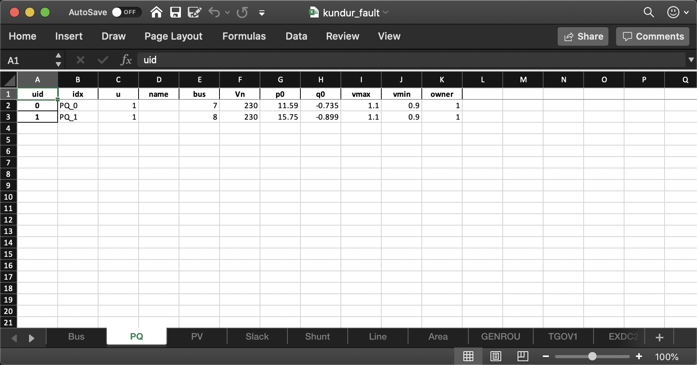

.. _tutorial:

********
Tutorial
********
ANDES can be used as a command-line tool or a library.
The command-line interface (CLI) comes handy to run studies.
As a library, it can be used interactively in the IPython shell or the Jupyter Notebook.
This chapter describes the most common usages.

Please see the cheat sheet if you are looking for quick help.

.. _sec-command:

Command Line Usage
==================

Basic Usage
-----------

ANDES is invoked from the command line using the command ``andes``.
Running ``andes`` without any input is equal to  ``andes -h`` or ``andes --help``.
It prints out a preamble with version and environment information and help commands::

        _           _         | Version 1.3.4
       /_\  _ _  __| |___ ___ | Python 3.8.6 on Linux, 03/17/2021 11:28:55 AM
      / _ \| ' \/ _` / -_|_-< |
     /_/ \_\_||_\__,_\___/__/ | This program comes with ABSOLUTELY NO WARRANTY.

    usage: andes [-h] [-v {1,10,20,30,40}]
            {run,plot,doc,misc,prepare,selftest} ...

    positional arguments:
    {run,plot,doc,misc,prepare,selftest}
                        [run] run simulation routine; [plot] plot results;
                        [doc] quick documentation; [misc] misc. functions;
                        [prepare] prepare the numerical code; [selftest] run
                        self test.

    optional arguments:
    -h, --help            show this help message and exit
    -v {1,10,20,30,40}, --verbose {1,10,20,30,40}
                        Verbosity level in 10-DEBUG, 20-INFO, 30-WARNING, or
                        40-ERROR.

.. note::

    If the ``andes`` command is not found, check if (1) the installation was successful, and
    (2) you have activated the environment where ANDES is installed.

The first-level commands are chosen from ``{run,plot,doc,misc,prepare,selftest}``.
Each command contains a group of sub-commands, which can be looked up with ``-h``.
For example, use ``andes run -h`` to look up the sub-commands for ``run``.
The most frequently used commands are explained in the following.

``andes`` has an option for the program verbosity level, controlled by ``-v LEVEL`` or ``--verbose LEVEL``,
where level is a number chosen from the following:
1 (DEBUG with code location info), 10 (DEBUG), 20 (INFO), 30 (WARNING), 40 (ERROR), or 50 (CRITICAL).
For example, to show debugging outputs, use ``andes -v 10``, followed by the first-level commands.
The default logging level is 20 (INFO).

andes selftest
--------------
After the installation, please run ``andes selftest`` from the command line to test ANDES functionality.
It might take a minute to run the full self-test suite.
An example output looks like ::

    test_docs (test_1st_system.TestCodegen) ... ok
    test_alter_param (test_case.Test5Bus) ... ok
    ...
    ... (outputs are truncated)
    ...
    test_pflow_mpc (test_pflow_matpower.TestMATPOWER) ... ok

    ----------------------------------------------------------------------
    Ran 23 tests in 13.834s

    OK

There may be more test than what is shown above. Make sure that all tests have passed.

.. warning ::
    ANDES is getting updates frequently. After every update, please run
    ``andes selftest`` to confirm the functionality.
    The command also makes sure the generated code is up to date.
    See `andes prepare`_ for more details on automatic code generation.

andes prepare
-----------------
.. _`andes prepare`:

The symbolically defined models in ANDES need to be generated into numerical code for simulation.
The code generation can be manually called with ``andes prepare``.
Generated code are serialized to ``~/.andes/calls.pkl`` and dumped as Python code to ``~/.andes/pycode``.
In addition, ``andes selftest`` implicitly calls the code generation.
If you are using ANDES as a package in the user mode (namely, you have not modified or updated ANDES code),
you will not need to call it again.

.. note ::
    To developers:
    As of version 1.3.0, ANDES stores all generated Python code explicitly
    in ``.py`` files under the folder ``~/.andes/pycode``.
    Priority is given to Python code when reloading for simulation.

Option ``-q`` or ``--quick`` (enabled by default) can be used to speed up the code generation.
It skips the generation of :math:`\LaTeX`-formatted equations, which are only used in documentation and the interactive
mode.

Option ``-i`` or ``--incremental``, instead of ``-q``, can be used to further speed up the code generation
during model development.
``andes prepare -i`` only generates code for models that have been modified since the last code generation.

.. note ::
    To developers:
    ``andes prepare -i`` needs to be called immediately following any model equation modification.
    Otherwise, simulation results will not reflect the new equations and will likely lead to an error.

andes run
-------------
``andes run`` is the entry point for power system analysis routines.
``andes run`` takes one positional argument, ``filename`` , along with other optional keyword arguments.
``filename`` is the test case path, either relative or absolute.

For example, the command ``andes run kundur_full.xlsx`` uses a relative path.
If will work only if ``kundur_full.xlsx`` exists in the current directory of the command line.
The commands ``andes run /Users/hcui7/kundur_full.xlsx`` (on macOS) or
``andes run C:/Users/hcui7/kundur_full.xlsx`` (on Windows) use absolute paths to the case files
and do not depend on the command-line current directory.

.. note ::
    When working with the command line, use ``cd`` to change directory to the folder
    containing your test case.
    Spaces in folder and file names need to be escaped properly.

Routine
.......
Option ``-r`` or ``-routine`` is used for specifying the analysis routine,
followed by the routine name.
Available routine names include ``pflow, tds, eig``:
- ``pflow`` for power flow
- ``tds`` for time domain simulation
- ``eig`` for eigenvalue analysis

``pflow`` is the default if ``-r`` is not given.

Power flow
..........
Locate the ``kundur_full.xlsx`` file at ``andes/cases/kundur/kundur_full.xlsx`` under the source code folder
or download it from https://github.com/cuihantao/andes/raw/master/andes/cases/kundur/kundur_full.xlsx.

Change to the directory containing ``kundur_full.xlsx``.
To run power flow, execute the following in the command line:

.. code:: bash

    andes run kundur_full.xlsx

The full path to the case file is also recognizable, for example,

.. code:: bash

    andes run /home/user/andes/cases/kundur/kundur_full.xlsx

The power flow report will be saved to the current directory where ANDES is run.
The report contains four sections: a) system statistics, b) ac bus
and dc node data, c) ac line data, and d) the initialized values of other
algebraic variables and state variables.

Time-domain simulation
......................

To run the time domain simulation (TDS) for ``kundur_full.xlsx``, run

.. code:: bash

    andes run kundur_full.xlsx -r tds

The output looks like::

    Parsing input file </Users/user/repos/andes/tests/kundur_full.xlsx>
    Input file kundur_full.xlsx parsed in 0.5425 second.
    -> Power flow calculation with Newton Raphson method:
    0: |F(x)| = 14.9283
    1: |F(x)| = 3.60859
    2: |F(x)| = 0.170093
    3: |F(x)| = 0.00203827
    4: |F(x)| = 3.76414e-07
    Converged in 5 iterations in 0.0080 second.
    Report saved to </Users/user/repos/andes/tests/kundur_full_out.txt> in 0.0036 second.
    -> Time Domain Simulation:
    Initialization tests passed.
    Initialization successful in 0.0152 second.
      0%|                                                    | 0/100 [00:00<?, ?%/s]
      <Toggle 0>: Applying status toggle on Line idx=Line_8
    100%|██████████████████████████████████████████| 100/100 [00:03<00:00, 28.99%/s]
    Simulation completed in 3.4500 seconds.
    TDS outputs saved in 0.0377 second.
    -> Single process finished in 4.4310 seconds.

This execution first solves the power flow as a starting point.
Next, the numerical integration simulates 20 seconds, during which a predefined
breaker opens at 2 seconds.

TDS produces two output files by default:
a compressed NumPy data file ``kundur_full_out.npz``
and a variable name list file ``kundur_full_out.lst``.
The list file contains three columns:
variable indices, variable name in plain text, and variable
name in the :math:`\LaTeX` format.
The variable indices are needed to plot the needed variable.

Disable output
..............
The output files can be disabled with option ``--no-output`` or ``-n``.
It is useful when only computation is needed without saving the results.

Profiling
.........
Profiling is useful for analyzing the computation time and code efficiency.
Option ``--profile`` enables the profiling of ANDES execution.
The profiling output will be written in two files in the current folder, one ending with ``_prof.txt`` and the
other one with ``_prof.prof``.

The text file can be opened with a text editor, and the ``.prof`` file can be visualized with ``snakeviz``,
which can be installed with ``pip install snakeviz``.

If the output is disabled, profiling results will be printed to stdio.

Multiprocessing
...............
ANDES takes multiple files inputs or wildcard.
Multiprocessing will be triggered if more than one valid input files are found.
For example, to run power flow for files with a prefix of ``case5`` and a suffix (file extension)
of ``.m``, run

.. code:: bash

    andes run case5*.m

Test cases that match the pattern, including ``case5.m`` and ``case57.m``, will be processed.

Option ``--ncpu NCPU`` can be used to specify the maximum number of parallel processes.
By default, all cores will be used. A small number can be specified to increase operation system responsiveness.

Format converter
................
.. _`format converter`:

ANDES recognizes a few input formats and can convert input systems into the ``xlsx`` format.
This function is useful when one wants to use models that are unique in ANDES.

The command for converting is ``--convert`` (or ``-c``),
following the output format (only ``xlsx`` is currently supported).
For example, to convert ``case5.m`` into the ``xlsx`` format, run

.. code:: bash

    andes run case5.m --convert xlsx

The output messages will look like ::

    Parsing input file </Users/user/repos/andes/cases/matpower/case5.m>
    CASE5  Power flow data for modified 5 bus, 5 gen case based on PJM 5-bus system
    Input file case5.m parsed in 0.0033 second.
    xlsx file written to </Users/user/repos/andes/cases/matpower/case5.xlsx>
    Converted file /Users/user/repos/andes/cases/matpower/case5.xlsx written in 0.5079 second.
    -> Single process finished in 0.8765 second.

Note that ``--convert`` will only create sheets for existing models.

In case one wants to create template sheets to add models later, ``--convert-all`` can be used instead.

If one wants to add workbooks to an existing xlsx file,
one can combine option ``--add-book ADD_BOOK`` (or ``-b ADD_BOOK``),
where ``ADD_BOOK`` can be a single model name or comma-separated
model names (without any space). For example,

.. code:: bash

    andes run kundur.raw -c -b Toggler

will convert file ``kundur.raw`` into an ANDES xlsx file (kundur.xlsx) and add
a template workbook for `Toggler`.

.. Warning::
    With ``--add-book``, the xlsx file will be overwritten.
    Any **empty or non-existent models** will be REMOVED.

PSS/E inputs
............
To work with PSS/E input files (.raw and .dyr), one need to provide the
raw file through ``casefile`` and pass the dyr file through ``--addfile``.
For example, in ``andes/cases/kundur``, one can run the power flow using

.. code:: bash

    andes run kundur.raw

and run a no-disturbance time-domain simulation using

.. code:: bash

    andes run kundur.raw --addfile kundur_full.dyr -r tds

.. note::
    If one wants to modify the parameters of models that are supported
    by both PSS/E and ANDES, one can directly
    edit those dynamic parameters in the ``.raw`` and ``.dyr`` files
    to maintain interoperability with other tools.

To create add a disturbance, there are two options.
The recommended option is to convert the PSS/E data into an ANDES xlsx file,
edit it and run (see the previous subsection).

An alternative is to edit the ``.dyr`` file with a planin-text editor (such as Notepad)
and append lines customized for ANDES models.
This is for advanced users after referring to ``andes/io/psse-dyr.yaml``,
at the end of which one can find the format of ``Toggler``: ::

    # === Custom Models ===
    Toggler:
        inputs:
            - model
            - dev
            - t

To define two Togglers in the ``.dyr`` file, one can append lines to the end
of the file using, for example, ::

    Line   'Toggler'  Line_2  1 /
    Line   'Toggler'  Line_2  1.1 /

which is separated by spaces and ended with a slash. The second parameter
is fixed to the model name quoted by a pair of single quotation marks,
and the others correspond to the fields defined in the above``inputs``.
Each entry is properly terminated with a forward slash.

andes plot
--------------
``andes plot`` is the command-line tool for plotting.
It currently supports time-domain simulation data.
Three positional arguments are required, and a dozen of optional arguments are supported.

positional arguments:

    +----------------+----------------------------------------------------------------------+
    | Argument       |             Description                                              |
    +================+======================================================================+
    | filename       |    simulation output file name, which should end with                |
    |                |    `out`. File extension can be omitted.                             |
    +----------------+----------------------------------------------------------------------+
    | x              |    the X-axis variable index, typically 0 for Time                   |
    +----------------+----------------------------------------------------------------------+
    | y              |    Y-axis variable indices. Space-separated indices or a             |
    |                |    colon-separated range is accepted                                 |
    +----------------+----------------------------------------------------------------------+

For example, to plot the generator speed variable of synchronous generator 1
``omega GENROU 0`` versus time, read the indices of the variable (2) and time
(0), run

.. code:: bash

    andes plot kundur_full_out.lst 0 2

In this command, ``andes plot`` is the plotting command for TDS output files.
``kundur_full_out.lst`` is list file name. ``0`` is the index of ``Time`` for
the x-axis. ``2`` is the index of ``omega GENROU 0``. Note that for the the file name,
either ``kundur_full_out.lst`` or ``kundur_full_out.npy`` works, as the program will
automatically extract the file name.

The y-axis variabla indices can also be specified in the Python range fashion
. For example, ``andes plot kundur_full_out.npy 0 2:21:6`` will plot the
variables at indices 2, 8, 14 and 20.

``andes plot`` will attempt to render with :math:`\LaTeX` if ``dvipng`` program is in the search path.
Figures rendered by :math:`\LaTeX` is considerably better in symbols quality but takes much longer time.
In case :math:`\LaTeX` is available but fails (frequently happens on Windows), the option ``-d`` can be used to disable
:math:`\LaTeX` rendering.

Other optional arguments are listed in the following.

optional arguments:
    ============================    ======================================================
    Argument                        Description
    ----------------------------    ------------------------------------------------------
    optional arguments:
    -h, --help                      show this help message and exit
    --xmin LEFT                     minimum value for X axis
    --xmax RIGHT                    maximum value for X axis
    --ymax YMAX                     maximum value for Y axis
    --ymin YMIN                     minimum value for Y axis
    --find FIND                     find variable indices that matches the given pattern
    ----------------------------    ------------------------------------------------------
    --xargs XARGS                   find variable indices and return as a list of
                                    arguments usable with "| xargs andes plot"
    ----------------------------    ------------------------------------------------------
    --exclude EXCLUDE               pattern to exclude in find or xargs results
    -x XLABEL, --xlabel XLABEL      x-axis label text
    -y YLABEL, --ylabel YLABEL      y-axis label text
    -s, --savefig                   save figure. The default fault is `png`.
    ----------------------------    ------------------------------------------------------
    -format SAVE_FORMAT             format for savefig. Common formats such as png, pdf, jpg are supported
    ----------------------------    ------------------------------------------------------
    --dpi DPI                       image resolution in dot per inch (DPI)
    -g, --grid                      grid on
    --greyscale                     greyscale on
    -d, --no-latex                  disable LaTeX formatting
    -n, --no-show                   do not show the plot window
    --ytimes YTIMES                 scale the y-axis values by YTIMES
    -c, --to-csv                    convert npy output to csv
    ============================    ======================================================

.. _andes_doc:

andes doc
---------
``andes doc`` is a tool for quick lookup of model and routine documentation.
It is intended as a quick way for documentation.

The basic usage of ``andes doc`` is to provide a model name or a routine name as the positional argument.
For a model, it will print out model parameters, variables, and equations to the stdio.
For a routine, it will print out fields in the Config file.
If you are looking for full documentation, visit `andes.readthedocs.io <https://andes.readthedocs.io>`_.

For example, to check the parameters for model ``Toggler``, run

.. code-block:: shell-session

    $ andes doc Toggler
    Model <Toggler> in Group <TimedEvent>

        Time-based connectivity status toggler.

    Parameters

     Name  |         Description          | Default | Unit |    Type    | Properties
    -------+------------------------------+---------+------+------------+-----------
     u     | connection status            | 1       | bool | NumParam   |
     name  | device name                  |         |      | DataParam  |
     model | Model or Group of the device |         |      | DataParam  | mandatory
           | to control                   |         |      |            |
     dev   | idx of the device to control |         |      | IdxParam   | mandatory
     t     | switch time for connection   | -1      |      | TimerParam | mandatory
           | status                       |         |      |            |

To list all supported models, run

.. code-block:: shell-session

    $ andes doc -l
    Supported Groups and Models

         Group       |                   Models
    -----------------+-------------------------------------------
     ACLine          | Line
     ACTopology      | Bus
     Collection      | Area
     DCLink          | Ground, R, L, C, RCp, RCs, RLs, RLCs, RLCp
     DCTopology      | Node
     Exciter         | EXDC2
     Experimental    | PI2
     FreqMeasurement | BusFreq, BusROCOF
     StaticACDC      | VSCShunt
     StaticGen       | PV, Slack
     StaticLoad      | PQ
     StaticShunt     | Shunt
     SynGen          | GENCLS, GENROU
     TimedEvent      | Toggler, Fault
     TurbineGov      | TG2, TGOV1

To view the Config fields for a routine, run

.. code-block:: shell-session

    $ andes doc TDS
    Config Fields in [TDS]

      Option   | Value |                  Info                  | Acceptable values
    -----------+-------+----------------------------------------+-------------------
     sparselib | klu   | linear sparse solver name              | ('klu', 'umfpack')
     tol       | 0.000 | convergence tolerance                  | float
     t0        | 0     | simulation starting time               | >=0
     tf        | 20    | simulation ending time                 | >t0
     fixt      | 0     | use fixed step size (1) or variable    | (0, 1)
               |       | (0)                                    |
     shrinkt   | 1     | shrink step size for fixed method if   | (0, 1)
               |       | not converged                          |
     tstep     | 0.010 | the initial step step size             | float
     max_iter  | 15    | maximum number of iterations           | >=10

andes misc
----------
``andes misc`` contains miscellaneous functions, such as configuration and output cleaning.

Configuration
.............
ANDES uses a configuration file to set runtime configs for the system routines, and models.
``andes misc --save-config`` saves all configs to a file.
By default, it saves to ``~/.andes/andes.conf`` file, where ``~``
is the path to your home directory.

With ``andes misc --edit-config``, you can edit ANDES configuration handy.
The command will automatically save the configuration to the default location if not exist.
The shorter version ``--edit`` can be used instead as Python matches it with ``--edit-config``.

You can pass an editor name to ``--edit``, such as ``--edit vim``.
If the editor name is not provided, it will use the following defaults:
- Microsoft Windows: notepad.
- GNU/Linux: the ``$EDITOR`` environment variable, or ``vim`` if not exist.

For macOS users, the default is vim.
If not familiar with vim, you can use nano with ``--edit nano`` or TextEdit with
``--edit "open -a TextEdit"``.

Cleanup
.......
``andes misc -C, --clean``

Option to remove any generated files. Removes files with any of the following
suffix: ``_out.txt`` (power flow report), ``_out.npy`` (time domain data),
``_out.lst`` (time domain variable list), and ``_eig.txt`` (eigenvalue report).

Interactive Usage
=================
This section is a tutorial for using ANDES in an interactive environment.
All interactive shells are supported, including Python shell, IPython, Jupyter Notebook and Jupyter Lab.
The examples below uses Jupyter Notebook.

Jupyter Notebook
----------------
Jupyter notebook is a convenient tool to run Python code and present results.
Jupyter notebook can be installed with

.. code:: bash

    conda install jupyter notebook

After the installation, change directory to the folder where you wish to store notebooks,
then start the notebook with

.. code:: bash

    jupyter notebook

A browser window should open automatically with the notebook browser loaded.
To create a new notebook, use the "New" button near the upper-right corner.

.. note::

    Code lines following ``>>>`` are Python code.
    Python code should be typed into a Python shell, IPython, or Jupyter Notebook,
    not a Anaconda Prompt or command-line shell.

Import
------
Like other Python libraries, ANDES needs to be imported into an interactive Python environment.

.. code:: python

    >>> import andes
    >>> andes.main.config_logger()

Verbosity
---------
If you are debugging ANDES, you can enable debug messages with

.. code:: python

    >>> andes.main.config_logger(stream_level=10)

The ``stream_level`` uses the same verbosity levels (see `Basic Usage`_) as for the command-line.
If not explicitly enabled, the default level 20 (INFO) will apply.

.. warning::
    The verbosity level can only be set once. To set a different level, restart the Python kernel.

Making a System
---------------
Before running studies, a "System" object needs to be create to hold the system data.
The System object can be created by passing the path to the case file the entry-point function.
For example, to run the file ``kundur_full.xlsx`` in the same directory as the notebook, use

.. code:: python

    >>> ss = andes.run('kundur_full.xlsx')

This function will parse the input file, run the power flow, and return the system as an object.
Outputs will look like ::

    Parsing input file </Users/user/notebooks/kundur/kundur_full.xlsx>
    Input file kundur_full.xlsx parsed in 0.4172 second.
    -> Power flow calculation with Newton Raphson method:
    0: |F(x)| = 14.9283
    1: |F(x)| = 3.60859
    2: |F(x)| = 0.170093
    3: |F(x)| = 0.00203827
    4: |F(x)| = 3.76414e-07
    Converged in 5 iterations in 0.0222 second.
    Report saved to </Users/user/notebooks/kundur_full_out.txt> in 0.0015 second.
    -> Single process finished in 0.4677 second.

In this example, ``ss`` is an instance of ``andes.System``.
It contains member attributes for models, routines, and numerical DAE.

Naming convention for the ``System`` attributes are as follows

- Model attributes share the same name as class names. For example, ``ss.Bus`` is the ``Bus`` instance.
- Routine attributes share the same name as class names. For example, ``ss.PFlow`` and ``ss.TDS`` are the
  routine instances.
- The numerical DAE instance is in lower case ``ss.dae``.

To work with PSS/E inputs, refer to notebook `Example 2`_.

.. _`Example 2`: https://github.com/cuihantao/andes/blob/master/examples/2.%20inspect_data.ipynb

Output path
...........
By default, outputs will be saved to the folder where Python is run (or where the notebook is run).
In case you need to organize outputs, a path prefix can be passed to ``andes.run()`` through
``output_path``.
For example,

.. code:: python

    >>> ss = andes.run('kundur_full.xlsx', output_path='outputs/')

will put outputs into folder ``outputs`` relative to the current path.
You can also supply an absolute path to ``output_path``.

No output
.........
Outputs can be disabled by passing ``output_path=True`` to ``andes.run()``.
This is useful when one wants to test code without looking at results.
For example, do

.. code:: python

    >>> ss = andes.run('kundur_full.xlsx', no_output=True)

Inspecting Parameter
--------------------

DataFrame
.........
Parameters for the loaded system can be easily inspected in Jupyter Notebook using Pandas.

Input parameters for each model instance is returned by the ``as_df()`` function.
For example, to view the input parameters for ``Bus``, use

.. code:: python

    >>> ss.Bus.as_df()

A table will be printed with the columns being each parameter and the rows being Bus instances.
Parameter in the table is the same as the input file without per-unit conversion.

Parameters have been converted to per unit values under system base.
To view the per unit values, use the ``as_df(vin=True)`` method.
For example, to view the system-base per unit value of ``GENROU``, use

.. code:: python

    >>> ss.GENROU.as_df(vin=True)

Dict
....
In case you need the parameters in ``dict``, use ``as_dict()``.
Values returned by ``as_dict()`` are system-base per unit values.
To retrieve the input data, use ``as_dict(vin=True)``.

For example, to retrieve the original input data of GENROU's, use

.. code:: python

    >>> ss.GENROU.as_dict(vin=True)

Running Studies
---------------

Three routines are currently supported: PFlow, TDS and EIG.
Each routine provides a ``run()`` method to execute.
The System instance contains member attributes having the same names.
For example, to run the time-domain simulation for ``ss``, use

.. code:: python

    >>> ss.TDS.run()

Checking Exit Code
------------------
``andes.System`` contains field ``exit_code`` for checking if error
occurred in run time.
A normal completion without error should always have ``exit_code == 0``.
One should read output messages carefully and check the exit code, which is
particularly useful for batch simulations.

Error may occur in any phase - data parsing, power flow, or simulation.
To diagnose, split the simulation steps and check the outputs from each one.

Plotting TDS Results
--------------------
TDS comes with a plotting utility for interactive usage.
After running the simulation, a ``plotter`` attributed will be created for ``TDS``.
To use the plotter, provide the attribute instance of the variable to plot.
For example, to plot all the generator speed, use

.. code:: python

    >>> ss.TDS.plotter.plot(ss.GENROU.omega)

.. note::

    If you see the error

        AttributeError: 'NoneType' object has no attribute 'plot'

    You will need to manually load plotter with

    .. code:: python

        >>> ss.TDS.load_plotter()

Optional indices is accepted to choose the specific elements to plot.
It can be passed as a tuple to the ``a`` argument

.. code:: python

    >>> ss.TDS.plotter.plot(ss.GENROU.omega, a=(0, ))

In the above example, the speed of the "zero-th" generator will be plotted.

Scaling
.......
A lambda function can be passed to argument ``ycalc`` to scale the values.
This is useful to convert a per-unit variable to nominal.
For example, to plot generator speed in Hertz, use

.. code:: python

    >>> ss.TDS.plotter.plot(ss.GENROU.omega, a=(0, ),
                            ycalc=lambda x: 60*x,
                            )

Formatting
..........
A few formatting arguments are supported:

- ``grid = True`` to turn on grid display
- ``greyscale = True`` to switch to greyscale
- ``ylabel`` takes a string for the y-axis label

Extracting Data
---------------
One can extract data from ANDES for custom plotting.
Variable names can be extracted from the following fields of
``ss.dae``:

Un-formatted names (non-LaTeX):

- ``x_name``: state variable names
- ``y_name``: algebraic variable names
- ``xy_name``: state variable names followed by algebraic ones

LaTeX-formatted names:

- ``x_tex_name``: state variable names
- ``y_tex_name``: algebraic variable names
- ``xy_tex_name``: state variable names followed by algebraic ones

These lists only contain the variable names used in the current analysis routine.
If you only ran power flow, ``ss.dae.y_name`` will only contain the power flow
algebraic variables, and ``ss.dae.x_name`` will likely be empty.
After initializing time-domain simulation, these lists will be extended to include
all variables used by TDS.

In case you want to extract the discontinuous flags from TDS, you can
set ``store_z`` to ``1`` in the config file under section ``[TDS]``.
When enabled, discontinuous flag names will be populated at

- ``ss.dae.z_name``: discontinuous flag names
- ``ss.dae.z_tex_name``: LaTeX-formatted discontinuous flag names

If not enabled, both lists will be empty.

Power flow solutions
....................
The full power flow solutions are stored at ``ss.dae.xy`` after running
power flow (and before initializing dynamic models).
You can extract values from ``ss.dae.xy``, which corresponds to the names
in ``ss.dae.xy_name`` or ``ss.dae.xy_tex_name``.

If you want to extract variables from a particular model, for example,
bus voltages, you can directly access the ``v`` field of that variable

.. code:: python

    >>> import numpy as np
    >>> voltages = np.array(ss.Bus.v.v)

which stores a **copy** of the bus voltage values. Note that the first ``v``
is the voltage variable of ``Bus``, and the second ``v`` stands for *value*.
It is important to make a copy by using ``np.array()`` to avoid accidental
changes to the solutions.

If you want to extract bus voltage phase angles, do

.. code:: python

    >>> angle = np.array(ss.Bus.a.v)

where ``a`` is the field name for voltage angle.

To find out names of variables in a model, refer to andes_doc_.

Time-domain data
................

Time-domain simulation data will be ready when simulation completes.
It is stored in ``ss.dae.ts``, which has the following fields:

- ``txyz``: a two-dimensional array. The first column is time stamps,
  and the following are variables. Each row contains all variables
  for that time step.
- ``t``: all time stamps.
- ``x``: all state variables (one column per variable).
- ``y``: all algebraic variables (one column per variable).
- ``z``: all discontinuous flags (if enabled, one column per flag).

If you want the output in pandas DataFrame, call

.. code:: python

    ss.dae.ts.unpack(df=True)

Dataframes are stored in the following fields of ``ss.dae.ts``:

- ``df``: dataframe for states and algebraic variables
- ``df_z``: dataframe for discontinuous flags (if enabled)

For both dataframes, time is the index column, and each column correspond to
one variable.

Pretty Print of Equations
----------------------------------------
Each ANDES models offers pretty print of :math:`\LaTeX`-formatted equations in the jupyter notebook environment.

To use this feature, symbolic equations need to be generated in the current session using

.. code:: python

    import andes
    ss = andes.System()
    ss.prepare()

Or, more concisely, one can do

.. code:: python

    import andes
    ss = andes.prepare()

This process may take a few minutes to complete.
To save time, you can selectively generate it only for interested models.
For example, to generate for the classical generator model ``GENCLS``, do

.. code:: python

    import andes
    ss = andes.System()
    ss.GENROU.prepare()

Once done, equations can be viewed by accessing ``ss.<ModelName>.syms.<PrintName>``,
where ``<ModelName>`` is the model name, and ``<PrintName>`` is the
equation or Jacobian name.

.. Note ::

    Pretty print only works for the particular ``System`` instance whose ``prepare()`` method is called.
    In the above example, pretty print only works for ``ss`` after calling ``prepare()``.

Supported equation names include the following:

- ``xy``: variables in the order of `State`, `ExtState`, `Algeb` and `ExtAlgeb`
- ``f``: the **right-hand side of** differential equations :math:`T \dot{\mathbf{x}} = \mathbf{f}`
- ``g``: implicit algebraic equations :math:`0 = \mathbf{g}`
- ``df``: derivatives of ``f`` over all variables ``xy``
- ``dg``: derivatives of ``g`` over all variables ``xy``
- ``s``: the value equations for `ConstService`

For example, to print the algebraic equations of model ``GENCLS``, one can use ``ss.GENCLS.syms.g``.

Finding Help
------------

General help
............

To find help on a Python class, method, or function, use the built-in ``help()`` function.
For example, to check how the ``get`` method of ``GENROU`` should be called, do

.. code:: python

    help(ss.GENROU.get)

In Jupyter notebook, this can be simplified into ``?ss.GENROU.get`` or ``ss.GENROU.get?``.

Model docs
..........

Model docs can be shown by printing the return of ``doc()``.
For example, to check the docs of ``GENCLS``, do

.. code:: python

    print(ss.GENCLS.doc())

It is the same as calling ``andes doc GENCLS`` from the command line.

Notebook Examples
=================
Check out more examples in Jupyter Notebook in the `examples` folder of the repository at
`here <https://github.com/cuihantao/andes/tree/master/examples>`_.
You can run the examples in a live Jupyter Notebook online using
`Binder <https://mybinder.org/v2/gh/cuihantao/andes/master>`_.

.. _formats:

I/O Formats
===========

Input Formats
-------------

ANDES currently supports the following input formats:

- ANDES Excel (.xlsx)
- PSS/E RAW (.raw) and DYR (.dyr)
- MATPOWER (.m)

ANDES xlsx Format
-----------------

The ANDES xlsx format is a newly introduced format since v0.8.0.
This format uses Microsoft Excel for conveniently viewing and editing model parameters.
You can use `LibreOffice <https://www.libreoffice.org>`_ or `WPS Office <https://www.wps.com/>`_ alternatively to
Microsoft Excel.

xlsx Format Definition
......................

The ANDES xlsx format contains multiple workbooks (tabs at the bottom).
Each workbook contains the parameters of all instances of the model, whose name is the workbook name.
The first row in a worksheet is used for the names of parameters available to the model.
Starting from the second row, each row corresponds to an instance with the parameters in the corresponding columns.
An example of the ``Bus`` workbook is shown in the following.

.. image:: images/tutorial/xlsx-bus.png
   :width: 600
   :alt: Example workbook for Bus

A few columns are used across all models, including ``uid``, ``idx``, ``name`` and ``u``.

- ``uid`` is an internally generated unique instance index. This column can be left empty if the xlsx file is
  being manually created. Exporting the xlsx file with ``--convert`` will automatically assign the ``uid``.
- ``idx`` is the unique instance index for referencing. An unique ``idx`` should be provided explicitly for each
  instance. Accepted types for ``idx`` include numbers and strings without spaces.
- ``name`` is the instance name.
- ``u`` is the connectivity status of the instance. Accepted values are 0 and 1. Unexpected behaviors may occur
  if other numerical values are assigned.

As mentioned above, ``idx`` is the unique index for an instance to be referenced.
For example, a PQ instance can reference a Bus instance so that the PQ is connected to the Bus.
This is done through providing the ``idx`` of the desired bus as the ``bus`` parameter of the PQ.

In the example PQ workbook shown above, there are two PQ instances on buses with ``idx`` being 7 and 8,
respectively.

Convert to xlsx
...............
Please refer to the the ``--convert`` command for converting a recognized file to xlsx.
See `format converter`_ for more detail.

Data Consistency
................

Input data needs to have consistent types for ``idx``.
Both string and numerical types are allowed
for ``idx``, but the original type and the referencing type must be the same.
Suppose we have a bus and a connected PQ.
The Bus device may use ``1`` or ``'1'`` as its ``idx``, as long as the
PQ device uses the same value for its ``bus`` parameter.

The ANDES xlsx reader will try to convert data into numerical types when possible.
This is especially relevant when the input ``idx`` is string literal of numbers,
the exported file will have them converted to numbers.
The conversion does not affect the consistency of data.

Parameter Check
...............
The following parameter checks are applied after converting input values to array:

- Any ``NaN`` values will raise a ``ValueError``
- Any ``inf`` will be replaced with :math:`10^{8}`, and ``-inf`` will be replaced with :math:`-10^{8}`.

Cheatsheet
===========
A cheatsheet is available for quick lookup of supported commands.

View the PDF version at

https://www.cheatography.com//cuihantao/cheat-sheets/andes-for-power-system-simulation/pdf/

Make Documentation
==================

The documentation you are viewing can be made locally in a variety of formats.
To make HTML documentation, change directory to ``docs``, and do

.. code:: bash

    make html

After a minute, HTML documentation will be saved to ``docs/build/html`` with the index page being ``index.html``.

A list of supported formats is as follows. Note that some format require additional compiler or library ::

    html        to make standalone HTML files
    dirhtml     to make HTML files named index.html in directories
    singlehtml  to make a single large HTML file
    pickle      to make pickle files
    json        to make JSON files
    htmlhelp    to make HTML files and an HTML help project
    qthelp      to make HTML files and a qthelp project
    devhelp     to make HTML files and a Devhelp project
    epub        to make an epub
    latex       to make LaTeX files, you can set PAPER=a4 or PAPER=letter
    latexpdf    to make LaTeX and PDF files (default pdflatex)
    latexpdfja  to make LaTeX files and run them through platex/dvipdfmx
    text        to make text files
    man         to make manual pages
    texinfo     to make Texinfo files
    info        to make Texinfo files and run them through makeinfo
    gettext     to make PO message catalogs
    changes     to make an overview of all changed/added/deprecated items
    xml         to make Docutils-native XML files
    pseudoxml   to make pseudoxml-XML files for display purposes
    linkcheck   to check all external links for integrity
    doctest     to run all doctests embedded in the documentation (if enabled)
    coverage    to run coverage check of the documentation (if enabled)
